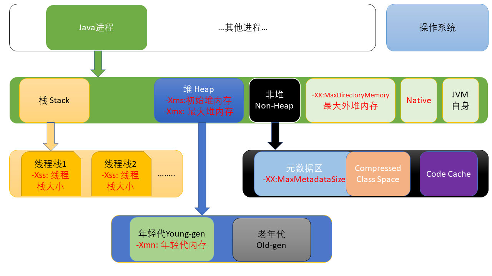
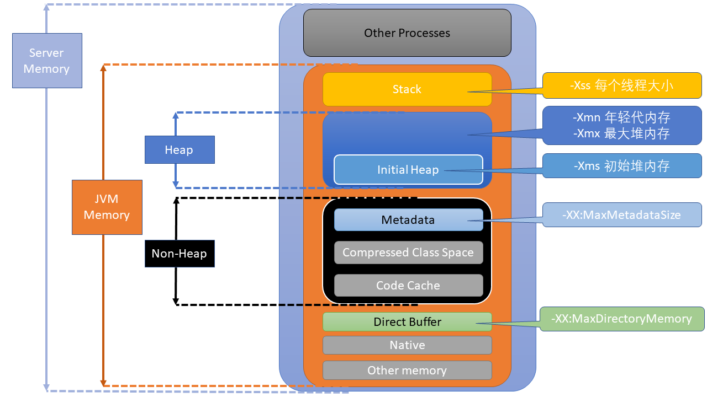

# 作业要求
2、自定义一个 Classloader，加载一个 Hello.xlass 文件，执行 hello 方法，此文件内容是一个 Hello.class 文件所有字节（x=255-x）处理后的文件。文件群里提供。

# JVM 内存参数关系图
一共画了两个图，尝试从两个角度解释以下内存参数的关系：
- **-Xss**: 设置每个线程栈的字节数。 例如 **-Xss1m** 指定线程栈为 1MB，与 **-XX:ThreadStackSize=1m** 等价。
- **-Xmx**: 指定最大堆内存，如 **-Xmx4g**。这只是限制了 Heap 部分的最大值为4g。这个内存不包括栈内存，也不包括堆外使用的内存。
- **-Xms**: 指定堆内存空间的初始大小，如 **-Xms4g**。 而且指定的内存大小，并不是操作系统实际分配的初始值，而是GC先规划好，用到才分配。专用服务器上需要保持 **–Xms** 和 **–Xmx** 一致，否则应用刚启动可能就有好几个 FullGC。当两者配置不一致时，堆内存扩容可能会导致性能抖动。
- **-Xmn**: 等价于 **-XX:NewSize**，年轻代内存。使用 G1 垃圾收集器 不应该 设置该选项，在其他的某些业务场景下可以设置。官方建议设置为 **-Xmx** 的 1/2 ~ 1/4.
- **-XX:MaxMetaspaceSize=size**: Java8 默认不限制 Metadata 空间, 一般不允许设置该选项。JDK1.7之前使用 **-XX:MaxPermSize=size**。
- **-XX:MaxDirectMemorySize=size**: 系统可以使用的最大堆外内存，这个参数跟 -Dsun.nio.MaxDirectMemorySize 效果相同。是JVM用于处理IO的buffer。
注意：**Native** 是Java用本地语言调用时所使用的内存。**Direct Memory** 和 **Native** 都不会被 GC 回收。

 

