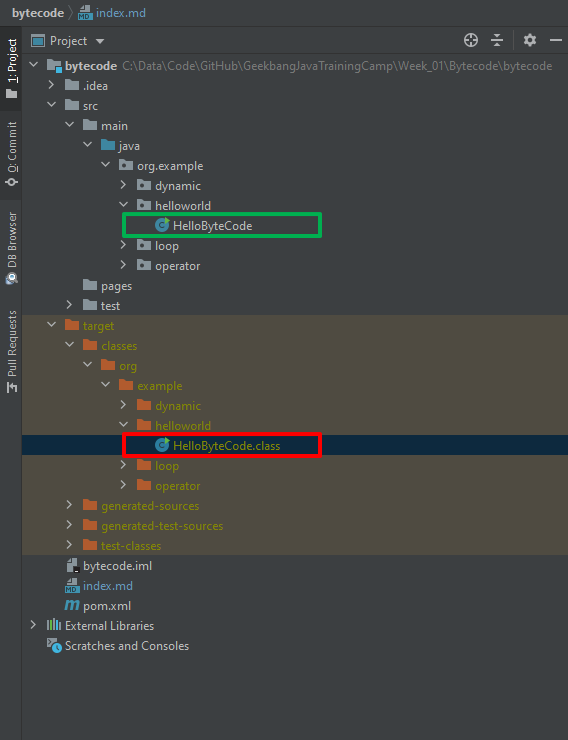

# [返回](index.md)

# 作业要求
1、自己写一个简单的 Hello.java，里面需要涉及基本类型，四则运行，if 和 for，然后
自己分析一下对应的字节码，有问题群里讨论。

# 演示Java Class文件的字节码(bytecode)，以及 javac 和 javap 工具的使用
- [Hello World](pages/helloworld.md)
- [四则运算](pages/ArithmeticOperation.md)
- [if 判断](pages/condition.md)
- [for 循环](pages/loop.md)

**Reference**:
- [View Bytecode of a Class File in Java](https://www.baeldung.com/java-class-view-bytecode)
 介绍了javac, javap 的基本用法，以及一些 bytecode 的小工具
- [Introduction to Java Bytecode](https://dzone.com/articles/introduction-to-java-bytecode)
 介绍了 bytecode 的基本概念，方便入门
- [The Java 11 Virtual Machine Instruction Set](https://docs.oracle.com/javase/specs/jvms/se11/html/jvms-6.html)
 Java 11 虚拟机指令集的官方文档。示例使用的java 11，文档中也会多次引用Java 11的官方文档。
- [The Java 8 Virtual Machine Instruction Set](https://docs.oracle.com/javase/specs/jvms/se8/html/jvms-6.html)
 Java 8 虚拟机指令集的官方文档。仅供对比参考。
# javac
Reads Java class and interface definitions and **compiles** them into bytecode and class files.
javac是用来编译 .java 文件的。

    Usage: javac <options> <source files>
    where possible options include:
      @<filename>                      Read options and filenames from file
      -Akey[=value]                    Options to pass to annotation processors
      --add-modules <module>(,<module>)*
                                       Root modules to resolve in addition to the initial modules, or all modules on the module path if <module> is ALL-MODULE-PATH.
      --boot-class-path <path>, -bootclasspath <path>
                                       Override location of bootstrap class files
      --class-path <path>, -classpath <path>, -cp <path>
                                       Specify where to find user class files and annotation processors
      -d <directory>                   Specify where to place generated class files
      -deprecation                     Output source locations where deprecated APIs are used
      --enable-preview                 Enable preview language features. To be used in conjunction with either -source or --release.
      -encoding <encoding>             Specify character encoding used by source files
      -endorseddirs <dirs>             Override location of endorsed standards path
      -extdirs <dirs>                  Override location of installed extensions
      -g                               Generate all debugging info
      -g:{lines,vars,source}           Generate only some debugging info
      -g:none                          Generate no debugging info
      -h <directory>                   Specify where to place generated native header files
      --help, -help, -?                Print this help message
      --help-extra, -X                 Print help on extra options
      -implicit:{none,class}
                                       Specify whether or not to generate class files for implicitly referenced files
      -J<flag>                         Pass <flag> directly to the runtime system
      --limit-modules <module>(,<module>)*
                                       Limit the universe of observable modules
      --module <module-name>, -m <module-name>
                                       Compile only the specified module, check timestamps
      --module-path <path>, -p <path>  Specify where to find application modules
      --module-source-path <module-source-path>
                                       Specify where to find input source files for multiple modules
      --module-version <version>       Specify version of modules that are being compiled
      -nowarn                          Generate no warnings
      -parameters                      Generate metadata for reflection on method parameters
      -proc:{none,only}                Control whether annotation processing and/or compilation is done.
      -processor <class1>[,<class2>,<class3>...]
                                       Names of the annotation processors to run; bypasses default discovery process
      --processor-module-path <path>   Specify a module path where to find annotation processors
      --processor-path <path>, -processorpath <path>
                                       Specify where to find annotation processors
      -profile <profile>               Check that API used is available in the specified profile
      --release <release>              Compile for a specific VM version. Supported targets: 6, 7, 8, 9, 10, 11
      -s <directory>                   Specify where to place generated source files
      -source <release>
                                       Provide source compatibility with specified release
      --source-path <path>, -sourcepath <path>
                                       Specify where to find input source files
      --system <jdk>|none              Override location of system modules
      -target <release>                Generate class files for specific VM version
      --upgrade-module-path <path>     Override location of upgradeable modules
      -verbose                         Output messages about what the compiler is doing
      --version, -version              Version information
      -Werror                          Terminate compilation if warnings occur

这里介绍一个最基本的用法，以 helloworld 为例，按照 IntelliJ IDEA 的文件组织结构编译java文件为class文件：

    cd "C:\Data\Code\GitHub\GeekbangJavaTrainingCamp\Week_01\Bytecode\bytecode"
    javac "src\main\java\org\example\helloworld\HelloByteCode.java" -d "target\classes"

# javap
javap (Java **Disassembler**): Disassembles one or more class files. 
javap是JDK提供的一个命令行工具,javap能对给定的class文件提供的字节代码进行反编译。
通过它，可以对照源代码和字节码，从而了解很多编译器内部的工作,对更深入地理解如何提高程序执行的效率等问题有极大的帮助。

    Usage: javap <options> <classes>
    where possible options include:
      -? -h --help -help               Print this help message
      -version                         Version information
      -v  -verbose                     Print additional information
      -l                               Print line number and local variable tables
      -public                          Show only public classes and members
      -protected                       Show protected/public classes and members
      -package                         Show package/protected/public classes and members (default)
      -p  -private                     Show all classes and members
      -c                               Disassemble the code
      -s                               Print internal type signatures
      -sysinfo                         Show system info (path, size, date, MD5 hash) of class being processed
      -constants                       Show final constants
      --module <module>, -m <module>   Specify module containing classes to be disassembled
      --module-path <path>             Specify where to find application modules
      --system <jdk>                   Specify where to find system modules
      --class-path <path>              Specify where to find user class files
      -classpath <path>                Specify where to find user class files
      -cp <path>                       Specify where to find user class files
      -bootclasspath <path>            Override location of bootstrap class files
    
    GNU-style options may use = instead of whitespace to separate the name of an option
    from its value.
    
    Each class to be shown may be specified by a filename, a URL, or by its fully
    qualified class name. Examples:
       path/to/MyClass.class
       jar:file:///path/to/MyJar.jar!/mypkg/MyClass.class
       java.lang.Object
