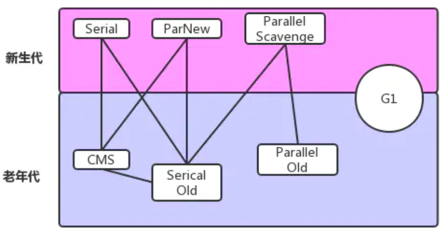

# [返回Week_02主页](index.md)

# 学习历程

GC 是对 JVM 内存的回收，学习GC，前提对 JVM 内存管理机制要十分了解。这里推荐如下链接：

- 极客时间 [Java性能调优实战](https://time.geekbang.org/column/intro/185) 的如下课程：
    - [21 | 磨刀不误砍柴工：欲知JVM调优先了解JVM内存模型](https://time.geekbang.org/column/article/106203)
    - [23 | 如何优化垃圾回收机制？](https://time.geekbang.org/column/article/107396) (**强烈推荐**)

- 极客时间 [深入拆解Java虚拟机](https://time.geekbang.org/column/intro/108) 的如下课程：
    - [13 | Java内存模型](https://time.geekbang.org/column/article/13484)
    - [11 | 垃圾回收（上）](https://time.geekbang.org/column/article/13091)
    - [12 | 垃圾回收（下）](https://time.geekbang.org/column/article/13137)

# 总结

GC 算法：

GC 回收器：

~~在 JDK1.8 环境下，默认使用的是 Parallel Scavenge（年轻代）+Serial Old（老年代）垃圾收集器。~~

- **在 JDK1.8 环境下，默认使用的是Parallel Scavenge（年轻代）+Parallel Old（老年代）垃圾收集器**。

- **cms在1.9已经被标记为废弃**，主要原因在于标记清除下的悬浮内存，导致内存空间碎片化，进而导致fullGC的发生。
    不过其并行执行垃圾回收的性能还是值得认可的，至少**1.9后主推的G1**在常规情况下也是不如它的效率好的。

- 拼G1的堆内存结构比较特殊，虽然也有年代划分，但从物理角度上却不一样。G1将整块内存分配成若干个同等大小的reg。新生代（两个sub区加ed区）和老年代各自由不同数量的reg组成。垃圾回收的算法应该算是标记整理。所以其规避了cms内存碎片化的问题，大大降低了fullGC的频率。所以它虽然常态性能略输于cms但却没有cms特殊情况下的极端性能问题，总体更稳定。值得一提的是G1中各代的内存区域里reg间不一定是连续的，所以对于cpu缓存加载机制并不是特别友好，而且大对象占据超过一个reg时还带来内存浪费的问题。

- 总的来说，**1.8可以用G1但得考虑场景，首先这个内存空间要大**，保证每个reg尽量大，以减少内存浪费，保守估计8g以上用g1。实际公司很少会去升级jdk版本，大部分都是1.8，好在oracle一些1.9、10、11、 12的特性都有以补丁的方式落到1.8，所以1.8还是比较安全实用的。

## Java 8

**在 JDK1.8 环境下，默认使用的是-XX:+UseParallelGC，即Parallel Scavenge（年轻代）+Parallel Old（老年代）垃圾收集器**。

| JVM 参数                | 新生代(别名)                   | 老年代                                         |
| ----------------------- | ------------------------------ | ---------------------------------------------- |
| -XX:+UseSerialGC        | Serial (DefNew)                | Serial Old (PSOldGen)                          |
| -XX:+UseParallelGC      | Parallel Scavenge (PSYoungGen) | Serial Old (PSOldGen)                          |
| -XX:+UseParallelOldGC   | Parallel Scavenge (PSYoungGen) | Parallel Old (ParOldGen)                       |
| -XX:-UseParNewGC        | ParNew (ParNew)                | Serial Old (PSOldGen)                          |
| -XX:+UseConcMarkSweepGC | ParNew (ParNew)                | CMS+Serial Old (PSOldGen) (**需要进一步验证**) |
| -XX:+UseG1GC            | G1                             | G1                                             |

**下图可能不正确**：

# Java 9 or later

Java 9 以后默认使用G1。请参照： [为什么G1 GC从JDK 9之后成为默认的垃圾回收器？](https://cloud.tencent.com/developer/article/1429131)

# Minor GC & Full GC

1. **minor gc是否会导致stop the world？**
    **答**：不管什么GC，都会发送stop the world，区别是发生的时间长短。而这个时间跟垃圾收集器又有关系，Serial、PartNew、Parallel Scavenge收集器无论是串行还是并行，都会挂起用户线程，而CMS和G1在并发标记时，是不会挂起用户线程，但其他时候一样会挂起用户线程，stop the world的时间相对来说小很多了。

2. **major gc什么时候会发生，它和full gc的区别是什么？**
    **答**：major gc很多参考资料指的是等价于full gc，我们也可以发现很多性能监测工具中只有minor gc和full gc。
    一般情况下，一次full gc将会对年轻代、老年代以及元空间、堆外内存进行垃圾回收。

    而触发Full GC的原因有很多：
    a. 当年轻代晋升到老年代的对象大小比目前老年代剩余的空间大小还要大时，此时会触发Full GC；
    b. 当老年代的空间使用率超过某阈值时，此时会触发Full GC;
    c. 当元空间不足时（JDK1.7永久代不足），也会触发Full GC;
    d. 当调用System.gc()也会安排一次Full GC;

