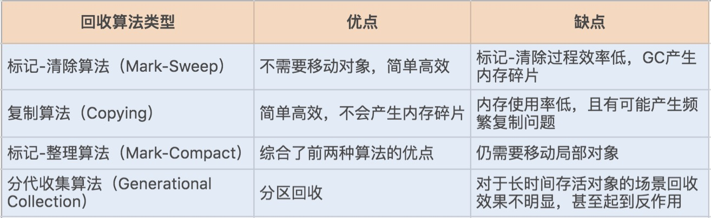

# [返回Week_02主页](index.md)

# 学习历程

GC 是对 JVM 内存的回收，学习GC，前提对 JVM 内存管理机制要十分了解。这里推荐如下链接：

- 极客时间 [Java性能调优实战](https://time.geekbang.org/column/intro/185) 的如下课程：
    - [21 | 磨刀不误砍柴工：欲知JVM调优先了解JVM内存模型](https://time.geekbang.org/column/article/106203)
    - [23 | 如何优化垃圾回收机制？](https://time.geekbang.org/column/article/107396) (**强烈推荐**)

- 极客时间 [深入拆解Java虚拟机](https://time.geekbang.org/column/intro/108) 的如下课程：
    - [13 | Java内存模型](https://time.geekbang.org/column/article/13484)
    - [11 | 垃圾回收（上）](https://time.geekbang.org/column/article/13091)
    - [12 | 垃圾回收（下）](https://time.geekbang.org/column/article/13137)

# 心得

## 并行 Parallel VS 并发 Concurrent

**Reference**:

- [并行parallel和并发concurrent的区别](https://www.cnblogs.com/chucklu/p/5808080.html)
- [并发和并行的区别](https://www.cnblogs.com/zlcxbb/p/5754346.html)
- [Difference between Concurrency and Parallelism](https://www.geeksforgeeks.org/difference-between-concurrency-and-parallelism/)

**Concurrency** is when two or more tasks can start, run, and complete in overlapping time periods. It doesn't necessarily mean they'll ever both be running at the same instant. Eg. multitasking on a single-core machine.

**Parallelism** is when tasks literally run at the same time, eg. on a multicore processor.
Quoting [Sun's Multithreaded Programming Guide](https://docs.oracle.com/cd/E19455-01/806-5257/6je9h032b/index.html):

- Concurrency: A condition that exists when at least two threads are making progress. A more generalized form of parallelism that can include time-slicing as a form of virtual parallelism.
- Parallelism: A condition that arises when at least two threads are executing simultaneously.

Technical vocabulary in IT industry is sometimes very confusing and **Concurrency** and **Parallelism** are some of them. Many developers think “Concurrency and parallelism means executing at the same time” which is right 50%, but with one big difference:

- Concurrency gives you a feel of parallelism and parallelism as the name implies is actual parallelism.

**Feel of parallelism** means you execute **multiple tasks on the same core** and the core switches context between tasks and serves them. You can also term this has time slicing / overlapping time period because your single core is just dedicating some time to one task and then some time to other.

**Actual parallelism** means you execute **multiple tasks on multiple cores** parallely.

**并发(Concurrency)**与**并行(Paralleism)**是两个既相似而又不相同的概念：并发性，又称共行性，是指能处理多个同时性活动的能力；并行是指同时发生的两个并发事件，具有并发的含义，而并发则不一定并行，也亦是说并发事件之间不一定要同一时刻发生。

**Note: Concurrency is a broader term and Parallelism is a subset of it.**

**并发(Concurrency)** 包括 **并行(Paralleism)**

**并发(Concurrency)**的实质是一个物理CPU(也可以多个物理CPU) 在若干道程序之间多路复用，并发性是对有限物理资源强制行使多用户共享以提高效率。

**并发(Concurrency)**是在同一个cpu上同时（不是真正的同时，而是看来是同时，因为cpu要在多个程序间切换）运行多个程序。

**并行(Paralleism)**指两个或两个以上事件或活动在同一时刻发生。在多道程序环境下，并行性使多个程序同一时刻可在不同CPU上同时执行。

**并行(Paralleism)**是每个cpu运行一个程序。

打个比方。并发，就像一个人（cpu）喂2个孩子（程序），轮换着每人喂一口，表面上两个孩子都在吃饭。并行，就是2个人喂2个孩子，两个孩子也同时在吃饭。

Mapping to the real world, the left image depicts parallelism the right image depicts concurrency.

## GC 算法

## GC 回收器

| JVM 参数                | 新生代(别名)                   | 老年代                                         |
| ----------------------- | ------------------------------ | ---------------------------------------------- |
| -XX:+UseSerialGC        | Serial (DefNew)                | Serial Old (PSOldGen)                          |
| -XX:-UseParNewGC        | ParNew (ParNew)                | Serial Old (PSOldGen)                          |
| -XX:+UseParallelOldGC   | Parallel Scavenge (PSYoungGen) | Parallel Old (ParOldGen)                       |
| -XX:+UseParallelGC      | Parallel Scavenge (PSYoungGen) | Serial Old (PSOldGen)                          |
| -XX:+UseConcMarkSweepGC | ParNew (ParNew)                | CMS+Serial Old (PSOldGen) (Serial Old作为备用) |
| -XX:+UseG1GC            | G1                             | G1                                             |

## 串行 GC

## 并行GC

## CMS GC

## G1 GC

## GC总结

- **在 JDK1.8 环境下，默认使用的是Parallel Scavenge（年轻代）+Parallel Old（老年代）垃圾收集器**。
- **cms在1.9已经被标记为废弃**，主要原因在于标记清除下的悬浮内存，导致内存空间碎片化，进而导致fullGC的发生。
    不过其并行执行垃圾回收的性能还是值得认可的，至少**1.9后主推的G1**在常规情况下也是不如它的效率好的。
- 拼G1的堆内存结构比较特殊，虽然也有年代划分，但从物理角度上却不一样。G1将整块内存分配成若干个同等大小的reg。新生代（两个sub区加ed区）和老年代各自由不同数量的reg组成。垃圾回收的算法应该算是标记整理。所以其规避了cms内存碎片化的问题，大大降低了fullGC的频率。所以它虽然常态性能略输于cms但却没有cms特殊情况下的极端性能问题，总体更稳定。值得一提的是G1中各代的内存区域里reg间不一定是连续的，所以对于cpu缓存加载机制并不是特别友好，而且大对象占据超过一个reg时还带来内存浪费的问题。
- 总的来说，**1.8可以用G1但得考虑场景，首先这个内存空间要大**，保证每个reg尽量大，以减少内存浪费，保守估计8g以上用g1。实际公司很少会去升级jdk版本，大部分都是1.8，好在oracle一些1.9、10、11、 12的特性都有以补丁的方式落到1.8，所以1.8还是比较安全实用的。

## Java 8

在 JDK1.8 环境下，默认使用的是-XX:+UseParallelGC，即Parallel Scavenge（年轻代）+Parallel Old（老年代）垃圾收集器。

## Java 9 or later

Java 9 以后默认使用G1。请参照： [为什么G1 GC从JDK 9之后成为默认的垃圾回收器？](https://cloud.tencent.com/developer/article/1429131)

## Minor GC & Full GC

1. **minor gc是否会导致stop the world？**
    **答**：不管什么GC，都会发送stop the world，区别是发生的时间长短。而这个时间跟垃圾收集器又有关系，Serial、PartNew、Parallel Scavenge收集器无论是串行还是并行，都会挂起用户线程，而CMS和G1在并发标记时，是不会挂起用户线程，但其他时候一样会挂起用户线程，stop the world的时间相对来说小很多了。

2. **major gc什么时候会发生，它和full gc的区别是什么？**
    **答**：major gc很多参考资料指的是等价于full gc，我们也可以发现很多性能监测工具中只有minor gc和full gc。
    一般情况下，一次full gc将会对年轻代、老年代以及元空间、堆外内存进行垃圾回收。

    而触发Full GC的原因有很多：
    a. 当年轻代晋升到老年代的对象大小比目前老年代剩余的空间大小还要大时，此时会触发Full GC；
    b. 当老年代的空间使用率超过某阈值时，此时会触发Full GC;
    c. 当元空间不足时（JDK1.7永久代不足），也会触发Full GC;
    d. 当调用System.gc()也会安排一次Full GC;

