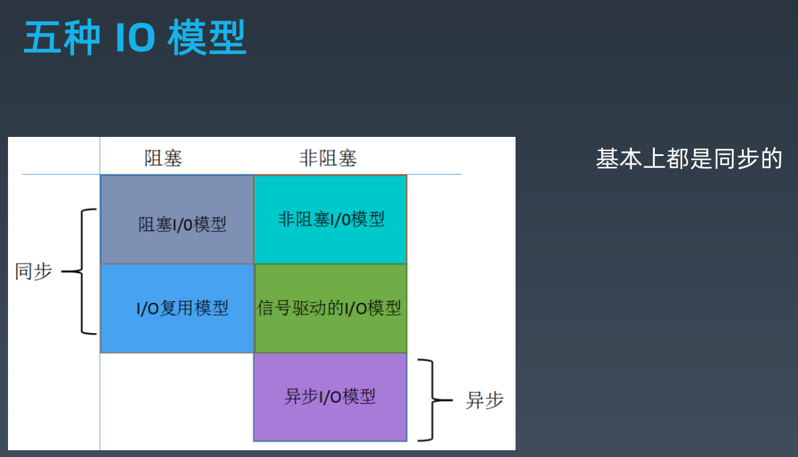
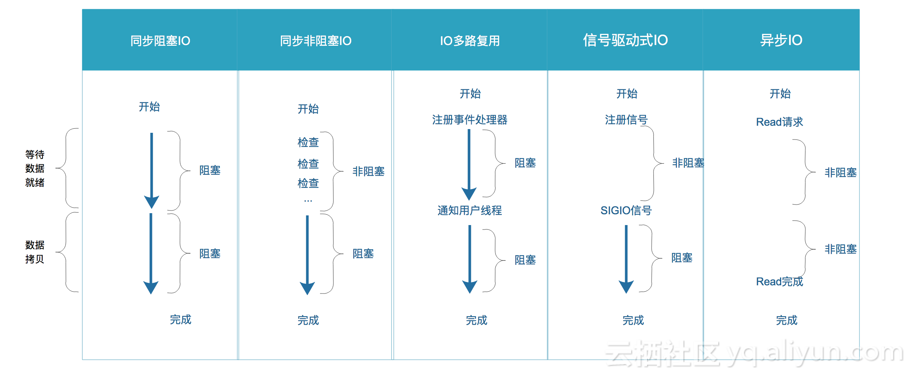

# [返回Week_02主页](index.md)

# IO 模型学习心得

根据秦老师的讲解，同时参考如下文档：
- https://yq.aliyun.com/articles/277102
- https://www.cnblogs.com/zhaowei5/p/9355577.html
- https://www.jianshu.com/p/0aca498f50ca

汇总如下几个基本知识点，方便日后理解：
## 阻塞(blocking) vs 非阻塞(non-blocking)
一个完整的IO读请求操作包括两个阶段：
1. 等待数据就绪；
2. 数据拷贝（将数据从内核拷贝到用户空间）。
阻塞和非阻塞的区别就在于第一个阶段，如果数据没有就绪，在查看数据是否就绪的过程中是一直等待，还是直接返回一个标志信息。
 依读操作为例：当用户线程发起一个IO读请求时，内核会去查看要读取的数据是否就绪，对于阻塞IO来说，如果数据没有就绪，则会一直在那等待，直到数据就绪；对于非阻塞IO来说，如果数据没有就绪，则会返回一个标志信息告知用户线程当前要读的数据没有就绪，当数据就绪之后，再将数据拷贝到用户线程。

## 同步(synchronous) vs 异步(asynchronous)
在说明synchronous IO（同步IO）和asynchronous IO（异步IO）的区别之前，需要先给出两者的定义。Stevens给出的定义（其实是POSIX的定义）如下：
- A synchronous I/O operation causes the requesting process to be blocked until that I/O operationcompletes;
- An asynchronous I/O operation does not cause the requesting process to be blocked; 

两者的区别就在于synchronous IO做**IO operation**的时候会将process阻塞。按照这个定义，blocking IO，non-blocking IO，IO multiplexing都属于synchronous IO。有人可能会说，non-blocking IO并没有被block啊。这里有个非常**狡猾**的地方，定义中所指的**IO operation**是指真实的IO操作，就是例子中的recvfrom这个system call。non-blocking IO在执行recvfrom这个system call的时候，如果kernel的数据没有准备好，这时候不会block进程。但是，当kernel中数据准备好的时候，recvfrom会将数据从kernel拷贝到用户内存中，这个时候进程是被block了，在这段时间内，进程是被block的。而asynchronous IO则不一样，当进程发起IO 操作之后，就直接返回再也不理睬了，直到kernel发送一个信号，告诉进程说IO完成。在这整个过程中，进程完全没有被block。
**注意**：select，poll，epoll都属于IO多路复用，而IO多路复用又属于同步的范畴，故，epoll只是一个伪异步而已。

## 非阻塞(non-blocking) vs 异步(asynchronous)
non-blocking IO和asynchronous IO的区别还是很明显的：
- 在non-blocking IO中，虽然进程大部分时间都不会被block，但是它仍然要求进程去主动的check，并且当数据准备完成以后，也需要进程主动的再次调用recvfrom来将数据拷贝到用户内存。
- asynchronous IO则完全不同。它就像是用户进程将整个IO操作交给了他人（kernel）完成，然后他人做完后发信号通知。在此期间，用户进程不需要去检查IO操作的状态，也不需要主动的去拷贝数据。

## 五种IO模型比较
五种IO模型的类型如下：

 
五种IO模型的比较如下：

 
用买票作类比，总结一下：
- **blocking IO（阻塞IO）**: 就像买票的时候必须自己一直在等着买，不能干别的事。
- **non-blocking IO（非阻塞IO）**: 间隔一段时间去问一下有票没有，可以干别的事；但是在得知有票的时候还要去排队买票，这时也不能干别的事（在此时也是阻塞的）。
- **IO multiplexing（IO多路复用）**: 同时监听多个窗口，某一窗口有票就去买。整个过程不能干其他的事。
- **signal driven IO（信号驱动IO）**: 在窗口留下自己的手机号码，然后去干别的事；在窗口电话通知有票的时候去排队买票，这时也不能干别的事（在此时也是阻塞的）。
- **asynchronous IO（异步IO）**: 委托携程、去哪儿购买，直接邮寄到家，可以一直干自己的事，不会受到任何干扰。
