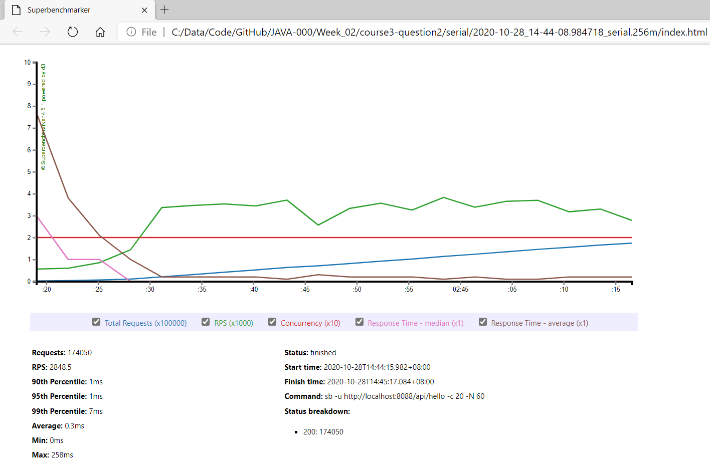
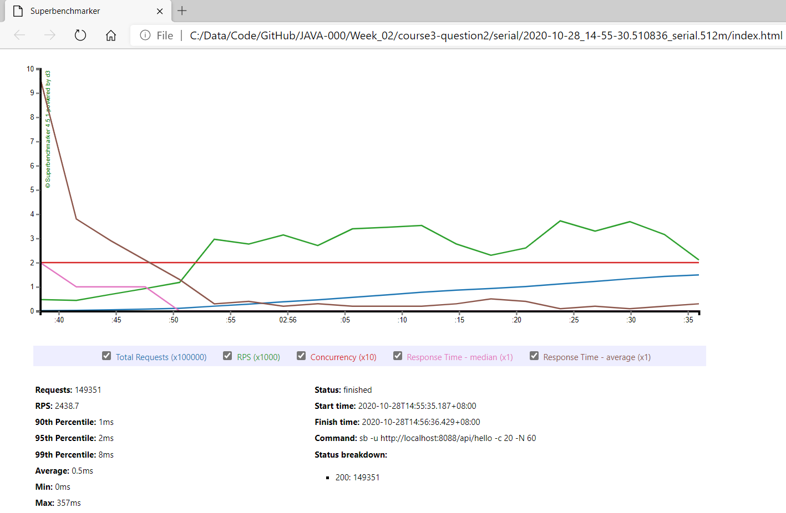
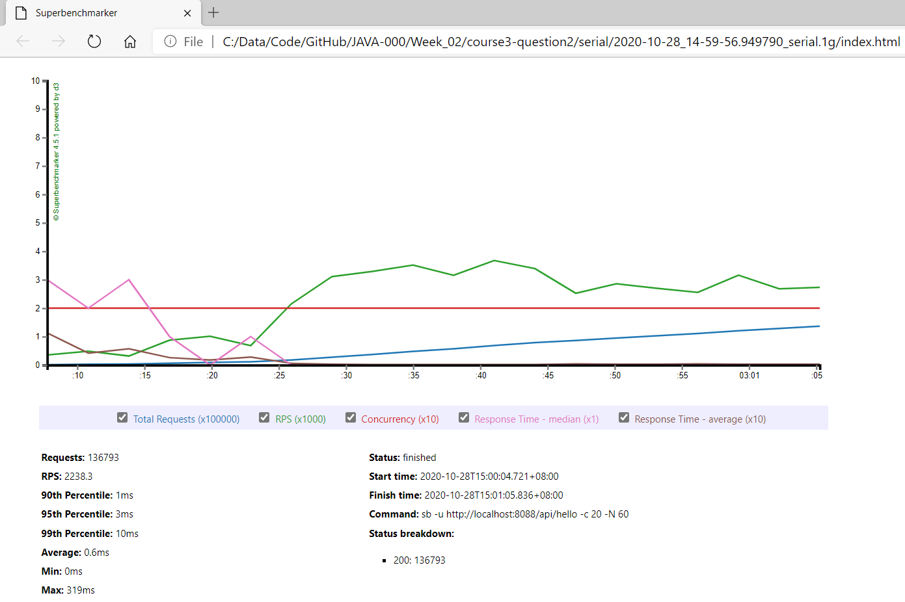

# [返回Week_02主页](index.md)

# [更多压力测试工具](StressTestTools.md)

# 作业要求
第 3 课作业实践
2、使用压测工具（wrk或sb），演练gateway-server-0.0.1-SNAPSHOT.jar 示例。

# 简述
我使用的是 Windows 系统，因此使用压测工作sb，演练 gateway-server-0.0.1-SNAPSHOT.jar 如下四个GC：
- **[串行](#串行)**
- **[并行](#并行)**
- **[CMS](#cms)**
- **[G1](#g1)**

我的笔记本是4核、8GB内存，可用内存不到2GB，因此只使用如下几个内存参数进行测试：
- 256MB
- 512MB
- 1GB
- 2GB

使用sb的命令如下：

    sb -u http://localhost:8088/api/hello -c 20 -N 60

# 串行
## SerialGC - 128MB
启动gateway-server-0.0.1-SNAPSHOT.jar的命令如下：

    java -jar -XX:+UseSerialGC -Xmx128m -Xms128m gateway-server-0.0.1-SNAPSHOT.jar

结果如下：
 

  

  
[Web Live Report](course3-question2/serial/2020-10-28_14-37-56.879899_serial.128m/index.html)

## SerialGC - 256MB
启动gateway-server-0.0.1-SNAPSHOT.jar的命令如下：

    java -jar -XX:+UseSerialGC -Xmx256m -Xms256m gateway-server-0.0.1-SNAPSHOT.jar

结果如下：
 

  

  
[Web Live Report](course3-question2/serial/2020-10-28_14-44-08.984718_serial.256m/index.html)

## SerialGC - 512MB
启动gateway-server-0.0.1-SNAPSHOT.jar的命令如下：

    java -jar -XX:+UseSerialGC -Xmx512m -Xms512m gateway-server-0.0.1-SNAPSHOT.jar

结果如下：
 

  

  
[Web Live Report](course3-question2/serial/2020-10-28_14-55-30.510836_serial.512m/index.html)

## SerialGC - 1GB
启动gateway-server-0.0.1-SNAPSHOT.jar的命令如下：

    java -jar -XX:+UseSerialGC -Xmx1g -Xms1g gateway-server-0.0.1-SNAPSHOT.jar

结果如下：
 

  

  
[Web Live Report](course3-question2/serial/2020-10-28_14-59-56.949790_serial.1g/index.html)

## SerialGC - 2GB
启动gateway-server-0.0.1-SNAPSHOT.jar的命令如下：

    java -jar -XX:+UseSerialGC -Xmx2g -Xms2g gateway-server-0.0.1-SNAPSHOT.jar

结果如下：
 

  

  
[Web Live Report](course3-question2/serial/2020-10-28_15-03-29.905306_serial.2g/index.html)

## SerialGC - 4GB
启动gateway-server-0.0.1-SNAPSHOT.jar的命令如下：

    java -jar -XX:+UseSerialGC -Xmx4g -Xms4g gateway-server-0.0.1-SNAPSHOT.jar

结果如下：
 

  

  
[Web Live Report](course3-question2/serial/2020-10-28_15-07-18.070700_serial.4g/index.html)

# 并行

# CMS

# G1

