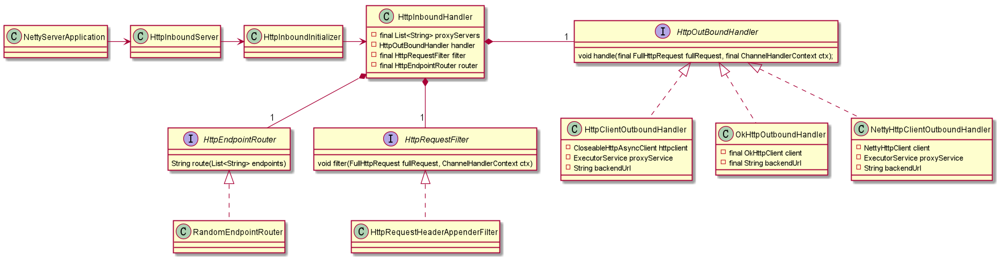

# Netty 学习历程

- [netty-example](netty-example/index.md): 学习netty官方文档。
- [netty-research](netty-research/index.md): 学习极客时间的课程 《[Netty源码剖析与实战](https://time.geekbang.org/course/intro/100036701)》第四章，练习程序的初级版。
- netty in action: （尚未完成课程）学习极客时间的课程 《[Netty源码剖析与实战](https://time.geekbang.org/course/intro/100036701)》第五章，练习程序的高级版。


# 作业

[作业的详细要求](homework.md)。


## 作业1：

**作业要求**：整合你上次作业的 httpclient/okhttp。

**答案**：（凭感觉实现的，估计还有问题。）

- [io.github.kimmking.gateway.outbound.httpclient4.HttpClientOutboundHandler](nio02/src/main/java/io/github/kimmking/gateway/outbound/httpclient4/HttpClientOutboundHandler.java)
- [io.github.kimmking.gateway.outbound.okhttp.OkHttpOutboundHandler](nio02/src/main/java/io/github/kimmking/gateway/outbound/okhttp/OkHttpOutboundHandler.java)


## 作业2：

**作业要求**：使用Netty实现http访问。

**答案**：（凭感觉实现的，估计还有问题。）

- [io.github.kimmking.gateway.outbound.netty4.NettyHttpClientOutboundHandler](nio02/src/main/java/io/github/kimmking/gateway/outbound/netty4/NettyHttpClientOutboundHandler.java)
- [io.github.kimmking.gateway.outbound.netty4.NettyHttpClient](nio02/src/main/java/io/github/kimmking/gateway/outbound/netty4/NettyHttpClient.java)


## 作业3：

**作业要求**：实现过滤器。

**答案**：[io.github.kimmking.gateway.filter.HttpRequestHeaderAppenderFilter](nio02/src/main/java/io/github/kimmking/gateway/filter/HttpRequestHeaderAppenderFilter.java)

增加了HTTP Header: nio = du feng


[io.github.kimmking.gateway.inbound.HttpInboundHandler](nio02/src/main/java/io/github/kimmking/gateway/inbound/HttpInboundHandler.java) class 是核心，它指向**filter**、**router**和**handler**。

```java
private HttpOutBoundHandler handler;
private final HttpRequestFilter filter;
private final HttpEndpointRouter router;
```

三种 **HttpOutBoundHandler** 是由 system property **outBoundHandlerType** 决定的：

```java
private void initHandler() {
    String outBoundHandlerType = System.getProperty("outBoundHandlerType", NettyServerApplication.HTTPCLIENT_MODE);
    if (outBoundHandlerType.equalsIgnoreCase(NettyServerApplication.HTTPCLIENT_MODE)) {
        handler = new HttpClientOutboundHandler(router.route(proxyServers));
    } else if (outBoundHandlerType.equalsIgnoreCase(NettyServerApplication.OKHTTP_MODE))  {
        handler = new OkHttpOutboundHandler(router.route(proxyServers));
    } else {
        handler = new NettyHttpClientOutboundHandler(router.route(proxyServers));
    }
}
```

system property **outBoundHandlerType** 是在[io.github.kimmking.gateway.NettyServerApplication](nio02/src/main/java/io/github/kimmking/gateway/NettyServerApplication.java) 中设置的。

```java
System.setProperty("outBoundHandlerType", NETTY_MODE);
```

类图如下：



## 作业4：

**作业要求**：实现路由。

**答案**：[io.github.kimmking.gateway.router.RandomEndpointRouter](nio02/src/main/java/io/github/kimmking/gateway/router/RandomEndpointRouter.java)

随机选取服务，对应于 [io.github.kimmking.gateway.NettyServerApplication](nio02/src/main/java/io/github/kimmking/gateway/NettyServerApplication.java) 的初始Server列表：

```java
String[] servers = {"http://localhost:8801",
        "http://localhost:8802",
        "http://localhost:8803",
        "http://localhost:8804",
        "http://localhost:8805"};
```