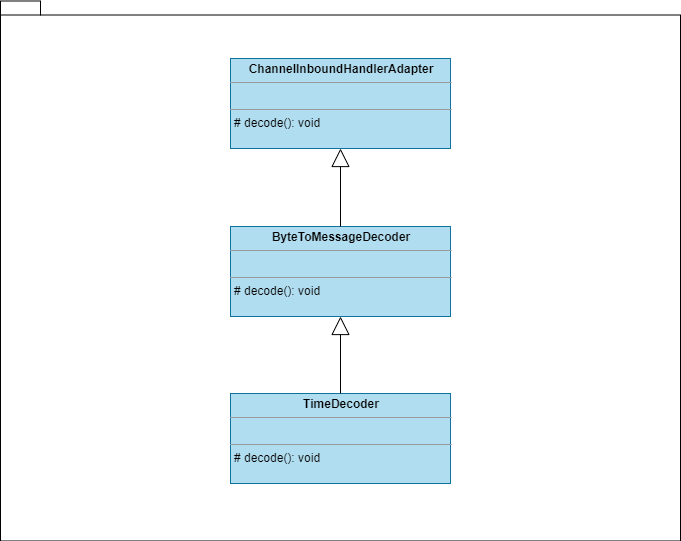
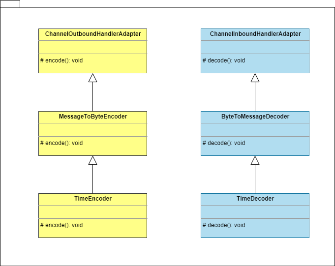

#  [返回主页](../index.md)

# Netty 4.1 Example

根据 netty 4.1 如下官方文档：

- [Netty User guide for 4.x](https://netty.io/wiki/user-guide-for-4.x.html)
- [Netty Github 4.1 Branch](https://github.com/netty/netty/)

练习如下官方示例程序：

- [discard](#discard)
- [echo](#echo)
- [time](#time)
- [stream](#stream) ：基于[time](#time)示例继续改进，演示netty解决TCP粘包/半包问题比较简单粗糙的方案。
- [stream2](#stream2) ：基于[stream](#stream)示例继续改进，演示netty解决TCP粘包/半包问题、相对优雅些的方案。
- [pojo](#pojo) ：基于[stream2](#stream2)示例继续改进，演示netty解决TCP粘包/半包问题的最优雅方案。

用于学习 netty 的功能和基本使用方法。

# discard
对应 [Writing a Discard Server](https://netty.io/wiki/user-guide-for-4.x.html#wiki-h3-5)。

Client连上Server后，Server忽略所有Client发送过来的消息。

运行方法如下：

1. 启动 DiscardServer
2. 在Window上可以使用如下telnet命令进行测试：

        telnet localhost 8009

# echo
对应 [Writing an Echo Server](https://netty.io/wiki/user-guide-for-4.x.html#wiki-h3-7)。

Client 中每输入一个字符，Server 就立即发送相同的字符给Client。

运行方法如下：

1. 启动 EchoServer
2. 在Window上可以使用如下telnet命令进行测试：

        telnet localhost 8005

# time

对应 [Writing a Time Server](https://netty.io/wiki/user-guide-for-4.x.html#wiki-h3-8)  和 [Writing a Time Client](https://netty.io/wiki/user-guide-for-4.x.html#wiki-h3-9) 。

当Client连上Server时，Server把系统当前时间发送给Client。

运行方法如下：

1. 启动 TimeServer

2. 在Windows可以启动 TimeClient 进行测试；在Linux上可以使用如下telnet命令进行测试：

       rdate -o 8005 -p localhost

# stream

对应 [Dealing with a Stream-based Transport > The First Solution](https://netty.io/wiki/user-guide-for-4.x.html#wiki-h4-12) ，基于 [time ](#time)的示例，演示netty解决TCP粘包/半包问题比较简单粗糙的方案：在 TimeClientHandler 的两个 life cycle listener methods: handlerAdded() and handlerRemoved() 中显式控制只读取4个byte。

当Client连上Server时，Server把系统当前时间发送给Client。

运行方法如下：

1. 启动 TimeServer

2. 在Windows可以启动 TimeClient 进行测试。


# stream2

对应 [Dealing with a Stream-based Transport > The Second Solution](https://netty.io/wiki/user-guide-for-4.x.html#wiki-h4-13) ，基于 [stream](#stream) 的示例，演示netty解决TCP粘包/半包问题、相对优雅些的方案：

1. 添加另一个TimeClientHandler: TimeDecoder，TimeDecoder继承自 ByteToMessageDecoder，而ByteToMessageDecoder继承自ChannelInboundHandlerAdapter，用于读取4个byte。

2. 将TimeDecoder添加至Client的ChannelPipeline：

    ```java
    b.handler(new ChannelInitializer<SocketChannel>() {
        @Override
        protected void initChannel(SocketChannel ch) throws Exception {
            ChannelPipeline p = ch.pipeline();
            if (sslCtx != null) {
                p.addLast(sslCtx.newHandler(ch.alloc(), HOST, PORT));
            }
            p.addLast(new LoggingHandler(LogLevel.INFO));
            p.addLast(new TimeDecoder(), new TimeClientHandler());
        }
    });
    ```

    TimeDecoder的类图如下：

    

    

当Client连上Server时，Server把系统当前时间发送给Client。

运行方法如下：

1. 启动 TimeServer

2. 在Windows可以启动 TimeClient 进行测试。

# pojo

对应 [Speaking in POJO instead of  ByteBuf](https://netty.io/wiki/user-guide-for-4.x.html#wiki-h3-14) ，基于 [stream2](#stream2) 的示例，演示netty解决TCP粘包/半包问题的最优雅方案：

1. 添加UnixTime，它用于封装时间，即server和client两端交流的data。

2. 添加TimeServerHandler: TimeEncoder；TimeDecoder继承自 MessageToByteEncoder，而MessageToByteEncoder继承自ChannelInboundHandlerAdapter，用于编码UnixTime。

3. 将TimeEncoder添加至Server的ChannelPipeline：

    ```java
    b.childHandler(new ChannelInitializer<SocketChannel>() {
        @Override
        protected void initChannel(SocketChannel ch) throws Exception {
            ChannelPipeline p = ch.pipeline();
            if (sslCtx != null) {
                p.addLast(sslCtx.newHandler(ch.alloc()));
            }
            p.addLast(new TimeEncoder(), serverHandler);
        }
    });
    ```

4. 添加TimeClientHandler: TimeDecoder；TimeDecoder继承自 ByteToMessageDecoder，而ByteToMessageDecoder继承自ChannelOutboundHandlerAdapter，用于解码UnixTime。

5. 将TimeDecoder添加至Client的ChannelPipeline：

    ```java
    b.handler(new ChannelInitializer<SocketChannel>() {
    	@Override
    	protected void initChannel(SocketChannel ch) throws Exception {
    		ChannelPipeline p = ch.pipeline();
    		if (sslCtx != null) {
    			p.addLast(sslCtx.newHandler(ch.alloc(), HOST, PORT));
    		}
    		p.addLast(new LoggingHandler(LogLevel.INFO));
    		p.addLast(new TimeDecoder(), new TimeClientHandler());
    	}
    });
    ```

TimeEncoder和TimeDecoder的类图如下：



当Client连上Server时，Server把系统当前时间发送给Client。

运行方法如下：

1. 启动 TimeServer

2. 在Windows可以启动 TimeClient 进行测试。