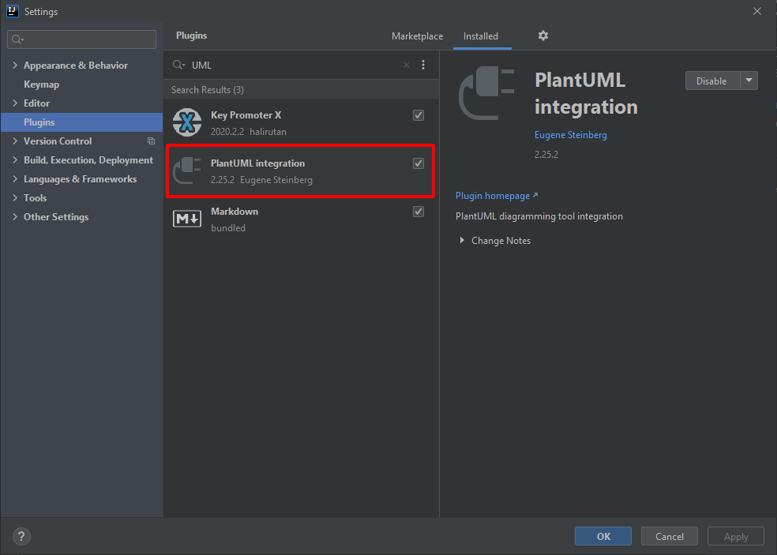
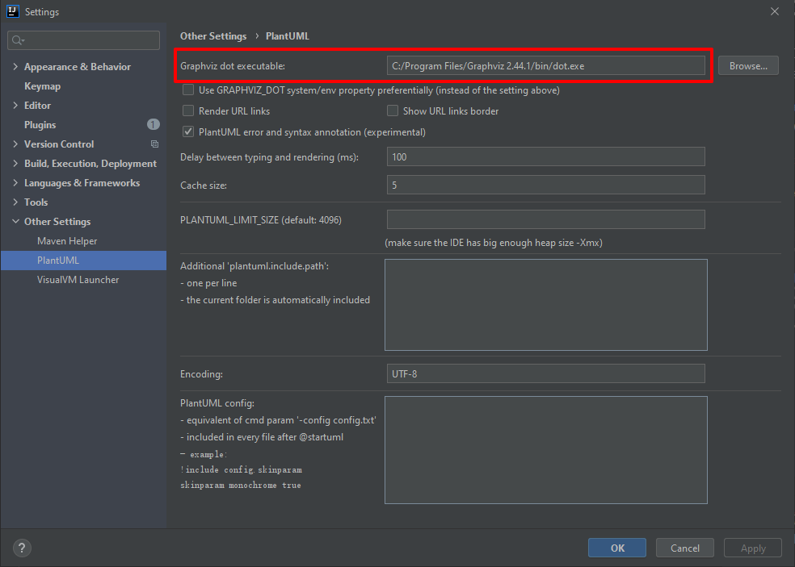

# IntelliJ IDEA 如何安装PlantUML integration plugin 

PlantUML 有两种生成UML图片的方法：

- Graphviz (推荐，可以实时生成图片)
- java -jar


## Graphviz

1. 安装 [Graphviz](https://graphviz.org/)。

    PlantUML 实时生成图片功能依赖 [Graphviz](https://graphviz.org/)。根据 [Test your Graphviz installation](https://plantuml.com/graphviz-dot) ，建议安装 Win32 版本的 Grahpviz。如果是version 2.44，要执行 **dot -c** 。

    


2. 打开 IntelliJ IDEA ，依次打开 File > Settings > Plugins，安装 **PlantUML integration** plugin。

    

    3. 重启 IntelliJ IDEA

    4. （可选）如果安装Graphviz 时没有选择把 dot.ext 添加至系统路径，则需要告诉PlantUML dot.exe路径。方法如下：

        依次打开 File > Settings > Other Settings > PlantUML ，指定 Graphviz dot.exe 的路径。

        

    

## jar

如果没有安装Graphviz，也可以使用java -jar命令生成图片：

```java
java -jar plantuml.jar -testdot
```

