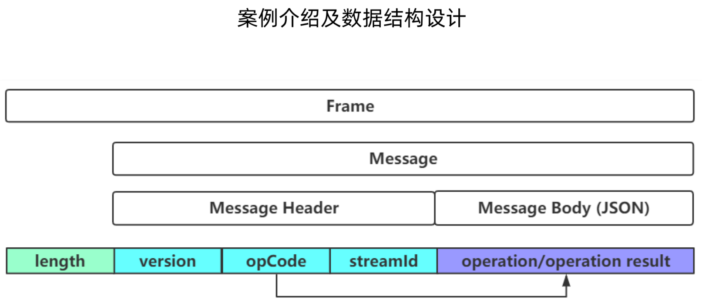

# [返回主页](../index.md)


# netty 初级

对应极客时间的课程 《[Netty源码剖析与实战](https://time.geekbang.org/course/intro/100036701)》第四章，练习程序的第一版。


# PlantUML

本示例使用 PlantUML 生成图片，请参照 [PlantUML Plugin Installation](PlantUML.md) 在 IntelliJ IDEA 上安装相关插件。


# Message Format

Client 和 Server 交流所使用的 Message 格式如下：




# Message Class Diagram

Message 的类图如下：


# Server Sequence Diagram

Server 的 childHandler pipeline 如下：

```java
serverBootstrap.childHandler(new ChannelInitializer<NioSocketChannel>() {
    @Override
    protected void initChannel(NioSocketChannel ch) throws Exception {
        ChannelPipeline pipeline = ch.pipeline();

        pipeline.addLast(new OrderFrameDecoder());
        pipeline.addLast(new OrderFrameEncoder());

        pipeline.addLast(new OrderProtocolDecoder());
        pipeline.addLast(new OrderProtocolEncoder());

        pipeline.addLast(new LoggingHandler(LogLevel.INFO));

        pipeline.addLast(new OrderServerProcessHandler());
    }
});
```

Server解析request的时序图如下（**注**：这只是粗略步骤，用于解释逻辑）：

- Decode: 接收到request时，
    - Handler的**channelRead**方法进行解码，Decoder的**channelRead**会进一步调用**decode**方法进行解码；
    - 解码完成后，**channelReadComplete**方法会把request传递给下一个handler，直至最后一个handler。
- Encode: 返回response时，
    - Handler的**write**方法加工response，Encoder会进一步调用**decode**加工response。
    - 加工完成后，**flush**会把response传递给下一个handler，直至返回至client端。


# ClientV0

**ClientV0**比较简单粗糙，它可以发送**RequestMessage**给Server，但是不能接收Server返回的**ResponseMessage**。

**ClientV0**使用如下pipeline:

```java
bootstrap.handler(new ChannelInitializer<NioSocketChannel>() {
    @Override
    protected void initChannel(NioSocketChannel ch) throws Exception {
        ChannelPipeline pipeline = ch.pipeline();
        pipeline.addLast(new OrderFrameDecoder());
        pipeline.addLast(new OrderFrameEncoder());

        pipeline.addLast(new OrderProtocolDecoder());
        pipeline.addLast(new OrderProtocolEncoder());

        pipeline.addLast(new LoggingHandler(LogLevel.INFO));
    }
});
```

发送 RequestMessage至Server端。

```
RequestMessage requestMessage = new RequestMessage(IdUtil.nextId(), new OrderOperation(1001, "tudou"));
channelFuture.channel().writeAndFlush(requestMessage);
```

# ClientV1

**ClientV1**它可以发送**RequestMessage**给Server，但是它仍然不能接收Server返回的**ResponseMessage**。

**ClientV1**使用如下pipeline，相对**ClientV0**，它多了一个**OperationToRequestMessageEncoder**:

```java
bootstrap.handler(new ChannelInitializer<NioSocketChannel>() {
    @Override
    protected void initChannel(NioSocketChannel ch) throws Exception {
        ChannelPipeline pipeline = ch.pipeline();
        pipeline.addLast(new OrderFrameDecoder());
        pipeline.addLast(new OrderFrameEncoder());

        pipeline.addLast(new OrderProtocolEncoder());
        pipeline.addLast(new OrderProtocolDecoder());

        pipeline.addLast(new OperationToRequestMessageEncoder());

        pipeline.addLast(new LoggingHandler(LogLevel.INFO));
    }
});
```

利用**OperationToRequestMessageEncoder**，可以发送**OrderOperation**至Server端。

```java
OrderOperation orderOperation = new OrderOperation(1001, "tudou");
channelFuture.channel().writeAndFlush(orderOperation);
```

**注意**：其实**ClientV1**也支持发送**RequestMessage**至Server端。

```java
RequestMessage requestMessage = new RequestMessage(IdUtil.nextId(), new OrderOperation(1001, "tudou"));
channelFuture.channel().writeAndFlush(requestMessage);
```

**OperationToRequestMessageEncoder** 继承自 **MessageToMessageEncoder<Operation>**，**MessageToMessageEncoder<Operation>**的**write**方法中，会通过**acceptOutboundMessage**检查msg是否为**Operation**：

- 是：才调用**encode**方法。
- 否：跳过，直接进入下一个Encoder或者Handler。

```java
if (this.acceptOutboundMessage(msg)) {
    out = CodecOutputList.newInstance();
    Object cast = msg;

    try {
        this.encode(ctx, cast, out);
    } finally {
        ReferenceCountUtil.release(msg);
    }

    if (out.isEmpty()) {
        throw new EncoderException(StringUtil.simpleClassName(this) + " must produce at least one message.");
    }

    var29 = false;
} else {
    ctx.write(msg, promise);
    var29 = false;
}
```

# ClientV2

通过**io.netty.example.study.client.handler.dispatcher**  package的如下三个class，**ClientV2**实现了响应分发，可以接收Server返回的**ResponseMessage**。

- OperationResultFuture
- RequestPendingCenter
- ResponseDispatcherHandler


**ClientV2**使用如下pipeline，相对**ClientV1**，它多了一个**ResponseDispatcherHandler**:

```java
bootstrap.handler(new ChannelInitializer<NioSocketChannel>() {
    @Override
    protected void initChannel(NioSocketChannel ch) throws Exception {
        ChannelPipeline pipeline = ch.pipeline();
        pipeline.addLast(new OrderFrameDecoder());
        pipeline.addLast(new OrderFrameEncoder());

        pipeline.addLast(new OrderProtocolEncoder());
        pipeline.addLast(new OrderProtocolDecoder());

        pipeline.addLast(new ResponseDispatcherHandler(requestPendingCenter));

        pipeline.addLast(new OperationToRequestMessageEncoder());

        pipeline.addLast(new LoggingHandler(LogLevel.INFO));
    }
});
```


**ClientV2**发送**RequestMessage**给Server端：

```java
long streamId = IdUtil.nextId();
RequestMessage requestMessage = new RequestMessage(streamId, new OrderOperation(1001, "tudou"));
OperationResultFuture operationResultFuture = new OperationResultFuture();

requestPendingCenter.add(streamId, operationResultFuture);
channelFuture.channel().writeAndFlush(requestMessage);
```

**requestPendingCenter**同时记录了**streamId**：

```java
public class RequestPendingCenter {
    private Map<Long, OperationResultFuture> map = new ConcurrentHashMap<>();

    public void add(Long streamId, OperationResultFuture future) {
        this.map.put(streamId, future);
    }
}
```

然后，**ClientV2**可以接收到Server返回的**OperationResult**：

```java
OperationResult operationResult = operationResultFuture.get();
```

**requestPendingCenter**会通过**streamId**去map中找到相对应的**operationResult**，并且返回给正确的ClientV2 （可以跑多个ClientV2进行测试）：

```
public class RequestPendingCenter {
    private Map<Long, OperationResultFuture> map = new ConcurrentHashMap<>();

    public void set(Long streamId, OperationResult operationResult) {
        OperationResultFuture operationResultFuture = this.map.get(streamId);
        if (operationResultFuture != null) {
            operationResultFuture.setSuccess(operationResult);
            this.map.remove(streamId);
        }
    }
}
```

