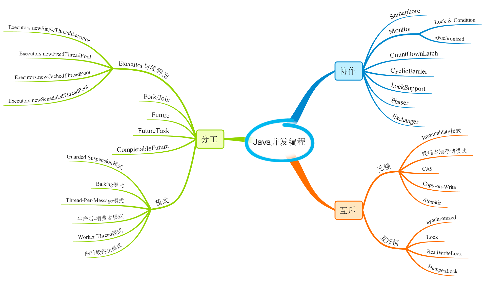

# Concurrency 学习历程

学习如下两个课程：

- 秦老师三次Java并发编程课程
- 极客时间《[Java并发编程实战](https://time.geekbang.org/column/intro/159)》

最终整理出[笔记](java-concurrency-in-practice/index.md)和示例代码。

# 作业

## 作业一

第7节课作业实践

1. （选做）把示例代码，运行一遍，思考课上相关的问题。也可以做一些比较。
2. （必做）思考有多少种方式，在main函数启动一个新线程，运行一个方法，拿到这
    个方法的返回值后，退出主线程？
    写出你的方法，越多越好，提交到github。

**答案**：这两题答案都在 [java-concurrency-in-practice](java-concurrency-in-practice) 这个project中。

**第一题**的答案在如下两个package中：

- package org.example.introduction
- package org.example.advance

重新整理了秦老师的示例程序，还添加了 org.example.introduction.lock.StampedLockDemo 示例程序。

笔记：[练习笔记](java-concurrency-in-practice/index.md)

**第二题**的答案在：package org.example.homework

一共实现了如下几种：

- CompletableFutureSolution
- CountDownLatchSolution
- CyclicBarrierSolution
- FutureSolution
- FutureTaskSolution
- LockSolution
- SemaphoreSolution
- SynchronizedSolution
- ThreadJoinSolution

## 作业二

（必做）把多线程和并发相关知识带你梳理一遍，画一个脑图，截图上传到github上。

**答案**：参照极客时间王宝令老师《[Java并发编程实战](https://time.geekbang.org/column/intro/159)》，从分工、协作、互斥三个角度整理如下脑图：

- 分工指的是如何高效地拆解任务并分配给线程。
- 同步指的是线程之间如何协作。
- 互斥则是保证同一时刻只允许一个线程访问共享资源。

