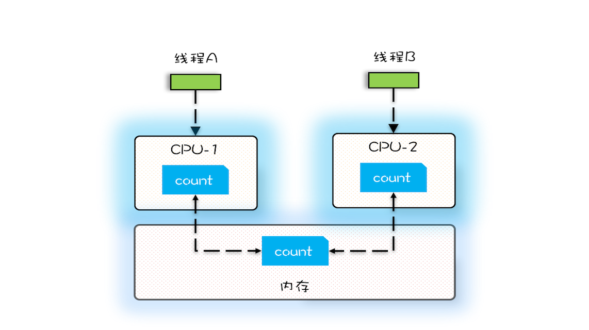

# [返回主页](../index.md)


# 简介

结合秦老师Java并发编程三次课程内容和示例程序、以及极客时间《[Java并发编程实战](https://time.geekbang.org/column/intro/159)》，记录自己学习Java并发编程的历程，作为对两个课程的补充，同时也加深自己的理解。


# 理论知识

## 并发编程领域三个核心问题

参照 [学习攻略 | 如何才能学好并发编程？](https://time.geekbang.org/column/article/83267)。

并发编程领域可以抽象成三个核心问题：分工、同步和互斥。

分工、同步主要强调的是性能；互斥主要是强调安全性，用专业术语叫“线程安全”。

### 分工

分工指的是如何高效地拆解任务并分配给线程。

Java SDK 并发包里的 Executor、Fork/Join、Future 本质上都是一种分工方法。除此之外，并发编程领域还总结了一些设计模式，基本上都是和分工方法相关的，例如生产者 - 消费者、Thread-Per-Message、Worker Thread 模式等都是用来指导你如何分工的。

### 同步

同步指的是线程之间如何协作。

一个线程执行完了一个任务，如何通知执行后续任务的线程开工。

工作中遇到的线程协作问题，基本上都可以描述为这样的一个问题：当某个条件不满足时，线程需要等待，当某个条件满足时，线程需要被唤醒执行。

协作一般是和分工相关的。Java SDK 并发包里的 Executor、Fork/Join、Future 本质上都是分工方法，但同时也能解决线程协作的问题。例如，用 Future 可以发起一个异步调用，当主线程通过 get() 方法取结果时，主线程就会等待，当异步执行的结果返回时，get() 方法就自动返回了。主线程和异步线程之间的协作，Future 工具类已经帮我们解决了。除此之外，Java SDK 里提供的 CountDownLatch、CyclicBarrier、Phaser、Exchanger 也都是用来解决线程协作问题的。


在 Java 并发编程领域，解决协作问题的核心技术是**管程**，上面提到的所有线程协作技术底层都是利用管程解决的。管程是一种解决并发问题的通用模型，除了能解决线程协作问题，还能解决下面我们将要介绍的互斥问题。可以这么说，**管程是解决并发问题的万能钥匙**。所以说，这部分内容的学习，关键是理解管程模型，学好它就可以解决所有问题。其次是了解 Java SDK 并发包提供的几个线程协作的工具类的应用场景，用好它们可以妥妥地提高你的工作效率。

### 互斥

互斥则是保证同一时刻只允许一个线程访问共享资源。

实现互斥的核心技术就是锁，Java 语言里 synchronized、SDK 里的各种 Lock 都能解决互斥问题。虽说锁解决了安全性问题，但同时也带来了性能问题，那如何保证安全性的同时又尽量提高性能呢？可以分场景优化，Java SDK 里提供的 ReadWriteLock、StampedLock 就可以优化读多写少场景下锁的性能。还可以使用无锁的数据结构，例如 Java SDK 里提供的原子类都是基于无锁技术实现的。除此之外，还有一些其他的方案，原理是不共享变量或者变量只允许读。这方面，Java 提供了 Thread Local 和 final 关键字，还有一种 Copy-on-write 的模式。


下图是Java并发编程的知识全景图：


## 并发编程的三大问题

参照 [01 | 可见性、原子性和有序性问题：并发编程Bug的源头](https://time.geekbang.org/column/article/83682)。

### 可见性

一个线程对共享变量的修改，另外一个线程能够立刻看到，我们称为可见性。

**缓存会导致可见性问题。**

多核 CPU 的缓存与内存关系图:



### 原子性

原子性是指一个操作是不可中断的，要么全部执行成功要么全部执行失败，有着**同生共死**的感觉。即使在多个线程一起执行的时候，一个操作一旦开始，就不会被其他线程所干扰。我们把一个或者多个操作在 CPU 执行的过程中不被中断的特性称为原子性。

**线程切换带来原子性问题。**

非原子操作的执行路径示意图:


### 有序性

**编译优化带来的有序性问题。**

双重检查创建单例的异常执行路径:


## Java关键字

参照 [02 | Java内存模型：看Java如何解决可见性和有序性问题](https://time.geekbang.org/column/article/84017)。

在并发编程中分析线程安全的问题时往往需要切入点，那就是两大核心：JMM抽象内存模型以及happens-before规则。

Java 内存模型是个很复杂的规范，可以从不同的视角来解读，站在我们这些程序员的视角，本质上可以理解为，Java 内存模型规范了 JVM 如何提供**按需禁用缓存和编译优化**的方法。具体来说，这些方法包括 **volatile**、**synchronized** 和 **final** 三个关键字，以及六项 **Happens-Before** 规则。

例如，我们声明一个 volatile 变量 volatile int x = 0，它表达的是：告诉编译器，对这个变量的读写，不能使用 CPU 缓存，必须从内存中读取或者写入。


## 用锁的最佳实践

Doug Lea《Java 并发编程：设计原则与模式》一书中，
推荐的三个用锁的最佳实践，它们分别是：

1. 永远只在更新对象的成员变量时加锁
2. 永远只在访问可变的成员变量时加锁
3. 永远不在调用其他对象的方法时加锁


另外，KK总结-最小使用锁：

1. 降低锁范围：锁定代码的范围/作用域
2. 细分锁粒度：讲一个大锁，拆分成多个小锁


## Java 线程状态

参照 [09 | Java线程（上）：Java线程的生命周期](https://time.geekbang.org/column/article/86366)

### 通用的线程生命周期

通用的线程生命周期基本上可以用下图这个“五态模型”来描述。这五态分别是：

- 初始状态
- 可运行状态
- 运行状态
- 休眠状态
- 终止状态。

通用线程状态转换图——五态模型:


### Java 中线程的生命周期

Java 语言中线程共有六种状态，分别是：

- NEW（初始化状态）
- RUNNABLE（可运行 / 运行状态）
- BLOCKED（阻塞状态）
- WAITING（无时限等待）
- TIMED_WAITING（有时限等待）
- TERMINATED（终止状态）

Java 中的线程状态转换图:


# 实践

以下会练习代码的重点讲解。

## package org.example.introduction

### DaemonThread

- 默认线程是前台线程，用于完成某个任务。

- 守护线程用于为其它线程提供服务，比如keep alive。可用如下代码指定一个线程为守护线程。

```java
thread.setDaemon(true);
```

- 当所有前台线程结束后，主线程就会结束，守护线程也就会随之结束。

**注**：由于这个练习中只有一个主线程、一个守护线程，也就是说没有任何任务线程，所以当为true时，守护线程不会启动。


### package org.example.introduction.start1

演示启动线程的一个方法：实现接口 **Runnable**，没有任何返回值。

类图如下：

```java
Runner1 runner1 = new Runner1();
Thread thread1 = new Thread(runner1);

Runner2 runner2 = new Runner2();
Thread thread2 = new Thread(runner2);

thread1.start();
thread2.start();
```

Runner1和Runner2都继承自Runnable，只有一个没有任何返回值的Run方法：

```java
public class Runner1 implements Runnable {
    @Override
    public void run() {
        for (int i = 0; i < 100; i++) {
            System.out.println("进入Runner1运行状态——————————" + i);
        }
    }
}
```

接下来演示如何中断线程2：

```
thread2.interrupt();
```

Runner2的run方法中会检查线程是否被中断，然后重置中断状态。

```
boolean result = Thread.currentThread().isInterrupted(); // 检查中断状态，结果为true
boolean result1 = Thread.interrupted(); // 重置状态
boolean result3 = Thread.currentThread().isInterrupted(); // 重新获取中断状态，结果为false
```

### package org.example.introduction.start2

这里演示了三种启动线程的办法：

- 实现  Class **Thread**。其实Thread实现了interface Runnable，它包含了创建线程的方法，可以自启动，但一样没有返回值。
- 实现接口**Runnable**，没有返回值。
- 实现接口**Callable**，有返回值，可以通过**FutureTask**获取到返回值。

类图如下：


### package org.example.introduction.sync

演示synchronized的使用方法：

- 实例方法锁的是 this 代表的对象
- 静态方法锁的是对应的 Class 对象
- synchronized块使用的是 this 对象
- synchronized(obj)使用的是obj对象

**注**：Thread3 中的锁无效。


### package org.example.introduction.collaboration1

演示了如何通过 thread.join() 实现线程间的协作和通信。

执行如下方法时，当前线程会暂停，直至thread1执行完，才会再继续执行当前线程。

```java
thread1.join();
```


### package org.example.introduction.collaboration2

演示了如何通过object.wait() 和 object.notifyAll() 实现线程间的协作和通信。

需要结合 synchronized ,它们的后台锁是 this，即当前对象：

- object.wait() : 放弃锁
- object.notify() : 通知一个等待的线程来抢这个锁
- object.notifyAll() : 通知所有等待的线程来抢这个锁


### package org.example.introduction.lock

演示lock的基本用法。

#### ConditionDemo

演示 lock 和 condition的结合使用方法。

#### ObjectCache

演示了Semaphore的使用方法。

#### package org.example.introduction.lock

演示ReentrantLock 的使用办法，它继承自interface Lock，在同一个线程中，可以多次获取到此锁。

#### package org.example.introduction.lock.reentrantreadwrite

演示ReentrantReadWriteLock 的使用办法，它继承自interface ReadWriteLock，有读、写两把锁。

注：ReadWriteLock 不支持 condition。

#### ReentrantReadWriteLockDemo2

继续演示ReentrantReadWriteLock 的使用办法。

#### package org.example.introduction.lock.deadlock

演示了一种死锁。

注：这里使用byte[]作为锁，不推荐这种用法，推荐使用object作为锁。

#### LockSupportDemo

演示LockSupport的使用方法。

- Thread 1 被park后，使用interrupt唤醒t1。
- Thread 1 被park后，使用unpark唤醒t1。

### package org.example.introduction.atomic

#### Count

实现了int的加法，但是线程不安全。

#### SyncCount

利用synchronized实现了线程安全的int加法。

#### AtomicCount和AtomicMain

演示了AtomicInteger的使用方法。

LongDemo

演示了AtomicLong和LongAdder。


## package org.example.advance.future

### CompletableFutureDemo

#### 创建 CompletableFuture 对象

创建 CompletableFuture 对象主要靠下面代码中展示的这 4 个静态方法，我们先看前两个：runAsync(Runnable runnable)和supplyAsync(Supplier supplier)，它们之间的区别是：Runnable 接口的 run() 方法没有返回值，而 Supplier 接口的 get() 方法是有返回值的。

前两个方法和后两个方法的区别在于：后两个方法可以指定线程池参数。

```java
//使用默认线程池
static CompletableFuture<Void> runAsync(Runnable runnable)
static <U> CompletableFuture<U> supplyAsync(Supplier<U> supplier)
//可以指定线程池  
static CompletableFuture<Void> runAsync(Runnable runnable, Executor executor)
static <U> CompletableFuture<U> supplyAsync(Supplier<U> supplier, Executor executor)
```

#### 如何理解 CompletionStage 接口

可以站在分工的角度类比一下工作流。任务是有时序关系的，比如有串行关系、并行关系、汇聚关系等。这样说可能有点抽象，这里还举前面烧水泡茶的例子，其中洗水壶和烧开水就是串行关系，洗水壶、烧开水和洗茶壶、洗茶杯这两组任务之间就是并行关系，而烧开水、拿茶叶和泡茶就是汇聚关系。

串行关系：


并行关系：


汇聚关系：


| Type                     | 串行                                                         |
| ------------------------ | ------------------------------------------------------------ |
| 有参数和返回值           | CompletionStage<R> thenApply(fn);<br/>CompletionStage<R> thenApplyAsync(fn); |
| 有参数，但是没有返回值   | CompletionStage<Void> thenAccept(consumer);<br/>CompletionStage<Void> thenAcceptAsync(consumer); |
| 无参数，无返回值         | CompletionStage<Void> thenRun(action);<br/>CompletionStage<Void> thenRunAsync(action); |
| 子流程（有参数和返回值） | CompletionStage<R> thenCompose(fn);<br/>CompletionStage<R> thenComposeAsync(fn); |


| Type                   | AND汇聚                                                      |
| ---------------------- | ------------------------------------------------------------ |
| 有参数和返回值         | CompletionStage<R> thenCombine(other, fn);<br/>CompletionStage<R> thenCombineAsync(other, fn); |
| 有参数，但是没有返回值 | CompletionStage<Void> thenAcceptBoth(other, consumer);<br/>CompletionStage<Void> thenAcceptBothAsync(other, consumer); |
| 无参数，无返回值       | CompletionStage<Void> runAfterBoth(other, action);<br/>CompletionStage<Void> runAfterBothAsync(other, action); |


| Type                   | OR汇聚                                                       |
| ---------------------- | ------------------------------------------------------------ |
| 有参数和返回值         | CompletionStage applyToEither(other, fn);<br/>CompletionStage applyToEitherAsync(other, fn); |
| 有参数，但是没有返回值 | CompletionStage acceptEither(other, consumer);<br/>CompletionStage acceptEitherAsync(other, consumer); |
| 无参数，无返回值       | CompletionStage runAfterEither(other, action);<br/>CompletionStage runAfterEitherAsync(other, action); |


#### 获取 CompletableFuture 结果

上面的组合完毕后，在最后执行join()方法，可以获取结果。