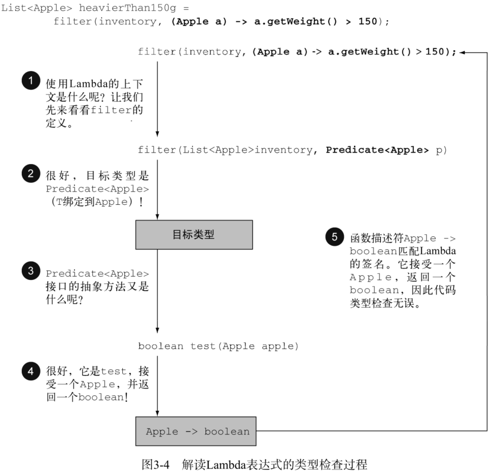

[toc]

# Java 8 新特性——函数式编程

## Introduction

按照秦老师课上讲解的内容，同时参考如下资料，学习Lambda、Method Reference和Stream的使用方法：

- 《Java in Action》
- [Exceptions in Java 8 Lambda Expressions]([Exceptions in Java 8 Lambda Expressions | Baeldung](https://www.baeldung.com/java-lambda-exceptions))
- [Sneakily Throwing Exceptions in Lambda Expressions in Java]([Sneakily Throwing Exceptions in Lambda Expressions in Java – { 4Comprehension }](https://4comprehension.com/sneakily-throwing-exceptions-in-lambda-expressions-in-java/))


当下还存在如下**不足**之处：

- Collect掌握的不太熟练。

- 并行数据处理理解的不够透彻。


函数式编程 (functional-style programming) 相对于指令式编程 (imperative programming) 的一个主要优点：你只需指出希望的结果——做什么，而不用操心执行的步骤——如何做。


## Parameterization

本章节是对《Java in Action》第二节的总结。

在Java中，参数化有两类办法：

- 值参数化 Value Parameterization

- 行为参数化 Behavior Parameterization

    - 类 Class

    - 匿名类 Anonymous Class

    - **Lambda （结合泛型generic、stream代码将会更加灵活、简洁）**


从编程和简洁角度的小结如下：


**下面通过一个筛选苹果的例子，简单介绍下这几种办法。**

### 值参数化 Value Parameterization

初步解决方案，如果下图所示，函数 filterGreenApples 内部只选出绿苹果。


改进后的方案如下，将颜色作为参数：


然后使用下面的方法调用函数：

```java
List<Apple> greenApples = filterApplesByColor(inventory, "green");
List<Apple> redApples = filterApplesByColor(inventory, "red");
```

如果有更多的筛选标准，则需要写为每一个筛选标准添加新的函数。下图是按颜色或重量选择苹果的另一个函数：


### 类 Class

下图是改善后的filterApples，它的第二个参数是Interface ApplePredicate，


下图是两个实现Interface ApplePredicate的子类：


可以把这些标准看作filter方法的不同行为，这些和**策略设计模式**相关，定义一族算法，把它们封装起来（称为**策略**），然后在运行时选择一个算法。在这里，算法族就是ApplePredicate，不同的策略就是 AppleHeavyWeightPredicate 和 AppleGreenColorPredicate。 


### 匿名类 Anonymous Class

匿名类和Java局部类（块中定义的类）差不多，但匿名类没有名字。它允许你同时声明并实例化一个类。换句话说，它允许你随用随建。 

下面的代码展示了如何通过创建一个用匿名类实现ApplePredicate的对象，重写筛选的例子： 


### Lambda

上面的代码在Java 8里可以用Lambda表达式重写为下面的样子： 


### 泛型

在通往抽象的路上，我们还可以更进一步，将List类型抽象化：


现在filter方法就可以用在香蕉、桔子、Integer或者String的列表上了：

```java
List<Apple> redApples = filter(inventory, (Apple apple) -> "red".equals(apple.getColor()));
List<Integer> evenNumbers = filter(numbers, (Integer i) -> i % 2 == 0);
```


## Lambda

可以把Lambda表达式理解为简洁地表示可传递的匿名函数的一种方式：它没有名称，但它有参数列表、函数主体、返回类型，可能还有一个可以抛出的异常列表：

- **匿名**——我们说匿名，是因为它不像普通的方法那样有一个明确的名称：写得少而想得多！ 

- **函数**——我们说它是函数，是因为Lambda函数不像方法那样属于某个特定的类。但和方法一样，Lambda有参数列表、函数主体、返回类型，还有可能有可以抛出的异常列表。 

- **传递**——Lambda表达式可以作为参数传递给方法或存储在变量中。 

- **简洁**——无需像匿名类那样写很多模板代码。 


Lambda 表达式基于数学中的λ演算得名，直接对应于其中的 lambda 抽象（lambda abstraction）。


### Java Lambda 表达式示例

比如，利用Lambda表达式，你可以更为简洁地自定义一个Comparator对象：


如上图所示，Lambda表达式有三个部分： 

- **参数列表**——这里它采用了Comparator中compare方法的参数，两个Apple。 

- **箭头**——箭头->把参数列表与Lambda主体分隔开。 

- **Lambda主体**——比较两个Apple的重量。表达式就是Lambda的返回值了。 


Lambda的基本语法（只有一行时Lambda 表达式可以省略大括号）：

- (parameters) -> expression
- (parameters) -> { statements; }


#### expression

下表是更多的有效的表达式：

| Lambda                                                       | Purpose                                                      |
| ------------------------------------------------------------ | ------------------------------------------------------------ |
| (String s) -> s.length()                                     | 具有一个String类型的参数并返回一个int。Lambda没有return语句，因为已隐含了return。 |
| (Apple a) -> a.getWeight() > 150                             | 有一个Apple类型的参数并返回一个boolean（苹果的重量是否超过 150克） |
| (int x, int y) -> {<br/>    System.out.println("Result:");<br/>    System.out.println(x+y);<br/>} | 具有两个int类型的参数而没有返回值(void返回）。注意Lambda表达式可以包含多行语句，这里是两行。 |
| () -> 42                                                     | 没有参数，返回一个int。                                      |
| (Apple a1, Apple a2) -> a1.getWeight().compareTo(a2.getWeight()) | 具有两个Apple类型的参数，返回一个int：比较两个Apple的重量。  |
| () -> 5                                                      | 不需要参数、返回值为 5                                       |
| x -> 2 * x                                                   | 接收一个参数(数字类型)、返回其2倍的值                        |
| (x, y) -> x – y                                              | 接受2个参数(数字)、并返回它们的差值                          |
| (int x, int y) -> x + y                                      | 接收2个int型整数、返回它们的和                               |
| (String s) -> System.out.print(s)                            | 接受一个 string 对象、并在控制台打印，不返回任何值(看起来像是返回 void) |
| (List<String> list) -> list.isEmpty()                        | 布尔表达式                                                   |
| () -> new Apple(10)                                          | 创建对象                                                     |
| (Apple a) -> {<br/>    System.out.println(a.getWeight());<br/>} | 消费一个对象                                                 |
| (String s) -> s.length()                                     | 从一个对象中选择/抽取                                        |
| (int a, int b) -> a * b                                      | 组合两个值                                                   |
| (Apple a1, Apple a2) -> a1.getWeight().compareTo(a2.getWeight()) | 比较两个对象                                                 |


下面这个测验，用于加深对Lambda Expression的理解：


### 在哪里以及如何使用Lambda

Lambda仅可用于上下文是函数式接口（Founcational Interface）的情况，只有在需要函数式接口的时候才可以传递Lambda。

Lambda表达式可以：

- 被赋给一个变量
- 传递给一个接受函数式接口作为参数的方法，当然这个Lambda表达式的签名要和函数式接口的抽象方法一样。


#### 函数式接口 Functional interface

**函数式接口就是只定义一个抽象方法的接口。**

下图是Java API中一些有效的函数式接口：


下图是个测验，以加深对函数式接口的理解：


用函数式接口可以干什么呢？Lambda表达式允许你直接以内联的形式为函数式接口的抽象方法提供实现，**并把整个表达式作为函数式接口的实例**（具体说来，是函数式接口一个具体实现的实例）。
用匿名内部类也可以完成同样的事情，只不过比较笨拙：需要提供一个实现，然后再直接内联将它实例化。

下面的代码是有效的，因为Runnable是一个只定义了一个抽象方法run的函数式接口：


#### 函数描述符 Function descriptor

函数式接口的抽象方法的签名基本上就是Lambda表达式的签名。我们将这种抽象方法叫作函数描述符。

注：正常方法签名是由方法名、形参列表、返回值三部分构成，基本形式是：

**全类名.方法名(形参数据类型列表)返回值数据类型**

但是，在使用Lambda时，它只关注形**参数据类型列表和返回值类型**两个部分。


#### 类型检查、类型推断以及限制

##### 类型检查

Lambda的类型是从使用Lambda的上下文推断出来的。上下文（比如，接受它传递的方法的参数，或接受它的值的局部变量）中Lambda表达式需要的类型称为**目标类型 target type** （也可以简单理解为函数式接口的抽象方法的形参数据类型列表+返回值类型）。

下图是一个类型检查过程解析：




##### 类型推断

你还可以进一步简化你的代码。Java编译器会从上下文（目标类型）推断出用什么函数式接口来配合Lambda表达式，这意味着它也可以推断出适合Lambda的签名，因为函数描述符可以通过目标类型来得到。这样做的好处在于，编译器可以了解Lambda表达式的参数类型，这样就可以在Lambda语法中ᄴ去标注参数类型。换句话说，Java编译器会像下面这样推断Lambda的参数类型：

 注意：

- 当Lambda仅有一个类型需要推断的参数时，参数名称两边的括号也可以省略。
- 有时候显式写出类型更易读，有时候去掉它们更易读。没有什么法则说哪种更好；对于如何让代码更易读，程序员必须做出自己的选择。 


##### 使用局部变量

迄今为止所介绍的所有Lambda表达式都只用到了其主体里面的参数。但Lambda表达式也允许使用**自由变量 free variables**（不是参数，而是在外层作用域中定义的变量），就像匿名类一样。 它们被称作**捕获Lambda (capturing lambdas)**。


**Lambda表达式引用的局部变量必须是最终的(final)或事实上最终的。这些变量必须是隐式最终的。可以认为Lambda
是对值封闭，而不是对变量封闭。**


例如，下面的代码无法编译，因为portNumber变量被赋值两次：


为什么局部变量有这些限制？

- 实例变量和局部变量背后的实现有一个关键不同。实例变量都存储在堆中，而局部变量则保存在栈上。如果Lambda可以直接访问局部变量，而且Lambda是在一个线程中使用的，则使用Lambda的线程，可能会在分配该变量的线程将这个变量收回之后，去访问该变量。因此，Java在访问自由局部变量时，实际上是在访问它的副本，而不是访问原始变量。如果局部变量仅仅赋值一次那就没有什么区别了——因此就有了这个限制。 
- 这一限制不鼓励你使用改变外部变量的典型命令式编程模式。


### 使用函数式接口实战

Putting lambdas into practice: the execute-around pattern

- 第 1步：记得行为参数化 
- 第2步：使用函数式接口来传递行为
- 第3步：执行一个行为
- 第4步：传递Lambda


### 深入 Java8 函数式接口 @FunctionalInterface

函数式接口定义且只定义了一个抽象方法。函数式接口很有用，因为抽象方法的签名可以描述Lambda表达式的签名。函数式接口的抽象方法的签名称为函数描述符。所以为了应用不同的Lambda表达式，需要一套能够描述常见函数描述符的函数式接口。

- Predicate<T> 有一个参数、条件判断
- Function<T, R> 有一个参数、有返回值
- Consumer<T> 有一个参数、无返回值
- Supplier<T>    无参数、有返回值
- BiPredicate<T, U> 有两个参数、条件判断
- BiFunction<T, U, R> 有两个参数、有返回值
- BiConsumer<T, U> 有两个参数、无返回值
- UnaryOperator<T> (UnaryOperator<T> extends Function<T, T>) 一个参数、相同类型的返回值
- BinaryOperator<T> (BinaryOperator<T> extends BiFunction<T,T,T>) 有两个相同类型的参数、相同类型的返回值


**Common functional interfaces added in Java 8 java.util.function package:**

| Functional interface                                         | Predicate<T>      | Consumer<T>                                                  |
| ------------------------------------------------------------ | ----------------- | ------------------------------------------------------------ |
| Predicate<T>                                                 | T -> boolean      | IntPredicate,<br/>LongPredicate,<br/>DoublePredicate         |
| Consumer<T>                                                  | T -> void         | IntConsumer,<br/>LongConsumer,<br/>DoubleConsumer            |
| Function<T, R>                                               | T -> R            | IntFunction<R>,<br/>IntToDoubleFunction,<br/>IntToLongFunction,<br/>LongFunction<R>,<br/>LongToDoubleFunction,<br/>LongToIntFunction,<br/>DoubleFunction<R>,<br/>DoubleToIntFunction,<br/>DoubleToLongFunction,<br/>ToIntFunction<T>,<br/>ToDoubleFunction<T>,<br/>ToLongFunction<T> |
| Supplier<T>                                                  | () -> T           | BooleanSupplier,<br/>IntSupplier,<br/>LongSupplier,<br/>DoubleSupplier |
| UnaryOperator<T><br/>(UnaryOperator<T> extends Function<T, T>) | T -> T            | IntUnaryOperator,<br/>LongUnaryOperator,<br/>DoubleUnaryOperator |
| BinaryOperator<T><br/>(BinaryOperator<T> extends BiFunction<T,T,T>) | (T, T) -> T       | IntBinaryOperator,<br/>LongBinaryOperator,<br/>DoubleBinaryOperator |
| BiPredicate<T, U>                                            | (T, U) -> boolean |                                                              |
| BiConsumer<T, U>                                             | (T, U) -> void    | ObjIntConsumer<T>,<br/>ObjLongConsumer<T>,<br/>ObjDoubleConsumer<T> |
| BiFunction<T, U, R>                                          | (T, U) -> R       | ToIntBiFunction<T, U>,<br/>ToLongBiFunction<T, U>,<br/>ToDoubleBiFunction<T, U> |


下面是一些示例：

| Use case                      | Example of lambda                                            | Matching functional interface                                |
| ----------------------------- | ------------------------------------------------------------ | ------------------------------------------------------------ |
| A boolean expression          | (List<String> list) -> list.isEmpty()                        | Predicate<List<String>>                                      |
| Creating objects              | () -> new Apple(10)                                          | Supplier<Apple>                                              |
| Consuming from an object      | (Apple a) -> System.out.println(a.getWeight())               | Consumer<Apple>                                              |
| Select/extract from an object | (String s) -> s.length()                                     | Function<String, Integer>,<br/>ToIntFunction<String>         |
| Combine two values            | (int a, int b) -> a * b                                      | IntBinaryOperator                                            |
| Compare two objects           | (Apple a1, Apple a2) -> a1.getWeight().compareTo(a2.getWeight()) | Comparator<Apple>,<br/>BiFunction<Apple, Apple, Integer>,<br/>ToIntBiFunction<Apple, Apple> |


## Method Reference

方法引用让你可以重复使用现有的方法定义，并像Lambda一样传递它们。在一些情况下，比起使用Lambda表达式，它们似乎更易读，感觉也更自然。方法引用可以被看作仅仅调用特定方法的Lambda的一种快捷写法。


它的基本思想是，如果一个Lambda代表的只是**直接调用这个方法**，那最好还是用名称来调用它，而不是去描述如何调用它。事实上，方法引用就是让你根据已有的方法实现来创建Lambda表达式。但是，显式地指明方法的名称，代码的可读性会更好。


它是如何工作的呢？当需要使用方法引用时，目标引用放在分隔符::前，方法的名称放在后面。

例如，Apple::getWeight就是引用了Apple类中定义的方法getWeight。（请记住，不需要括号，因为没有实际调用这个方法。）

方法引用就是Lambda表达式(Apple a) -> a.getWeight()的快捷写法。


下表给出了Java 8中方法引用的其他一些例子。 

| Lambda                                   | 等效的方法引用                    |
| ---------------------------------------- | --------------------------------- |
| (Apple a) -> a.getWeight()               | Apple::getWeight                  |
| () -> Thread.currentThread().dumpStack() | Thread.currentThread()::dumpStack |
| (str, i) -> str.substring(i)             | String::substring                 |
| (String s) -> System.out.println(s)      | System.out::println               |


### 如何构建方法引用

方法引用主要有三类：

1. 指向**静态方法**的方法引用（例如Integer的parseInt方法，写作Integer::parseInt）。
2. 指向**任意类型实例方法**的方法引用（ 例 如 String 的 length 方 法 ，写作String::length）。
3. 指向**现有对象的实例方法**的方法引用（假设你有一个局部变量expensiveTransaction用于存放Transaction类型的对象，它支持实例方法getValue，那么你就可以写expensiveTransaction::getValue）。 
4. 构造函数
5. 数组构造函数
6. 父类调用（super-call）


比如，下面的Lambda：

```java
List<String> str = Arrays.asList("a", "b", "A", "B");
str.sort((s1,s2) -> s1.compareToIgnoreCase(s2));
```

可以更改为如下Method Reference（对应办法2）:

```java
List<String> str = Arrays.asList("a", "b", "A", "B");
str.sort(String::compareToIgnoreCase);
```


再通过下面的测验加深理解：


#### 构造函数引用

**没有参数的构造函数**：

例如，假设有一个构造函数没有参数。它适合Supplier的签名() -> Apple。你可以这样做：


**有参数的构造函数**：

如果构造函数的签名是Apple(Integer weight)，那么它就适合Function接口的签名，于是可以这样写： 


在下面的代码中，一个由Integer构成的List中的每个元素都通过我们前面定义的类似的map方法传递给了Apple的构造函数，得到了一个具有不同重量苹果的List：


如果你有一个具有两个参数的构造函数Apple(String color, Integer weight)，那么它就适合BiFunction接口的签名，于是你可以这样写： 


不将构造函数实例化却能够引用它，这个功能有一些有趣的应用。例如，可以使用Map来将构造函数映射到字符串值。可以创建一个giveMeFruit方法，给它一个String和一个Integer，它就可以创建出不同重量的各种水果：


### Lambda和方法引用实战

- 第1步：传递代码

    ```java
    public class AppleComparator implements Comparator<Apple> {
        public int compare(Apple a1, Apple a2) {
            return a1.getWeight().compareTo(a2.getWeight());
        }
    } 
     
    inventory.sort(new AppleComparator());
    ```


- 第2步：使用匿名类

    ```java
    inventory.sort(new Comparator<Apple>() {
        public int compare(Apple a1, Apple a2) {
            return a1.getWeight().compareTo(a2.getWeight());
        }
    });
    ```

    

- 第3步：使用Lambda表达式

    下面三种方法都正确，每一种都比前一种更为紧凑、简洁：

    ```java
    inventory.sort((Apple a1, Apple a2) -> a1.getWeight().compareTo(a2.getWeight()));
    ```

    ```java
    inventory.sort((a1, a2) -> a1.getWeight().compareTo(a2.getWeight()));
    ```

    ```java
    import static java.util.Comparator.comparing;
    inventory.sort(comparing((a) -> a.getWeight()));
    ```

    

- 第4步：使用方法引用

    ```java
    import static java.util.Comparator.comparing;
    inventory.sort(comparing(Apple::getWeight));
    ```


## Lambda表达式组合

这里不再介绍，请参照《Java in Action》的3.8小节。


## Stream

### 什么是流

流是Java API的新成员，它允许你以声明性方式处理数据集合（通过查询语句来表达，而不是临时编写一个实现）。就现在来说，你可以把它们看成遍历数据集的高级迭代器。此外，流还可以透明地并行处理，你无需写任何多线程代码了！


我们简单看看使用流的好处吧。下面两段代码都是用来返回低热量的菜肴名称的，并按照卡路里排序，一个是用Java 7写的，另一个是用Java 8的流写的。比较一下。


通过上面的例子，从软件工程师的角度来看，新的方法有几个显而易见的好处：

- 代码是以声明性方式写的：说明想要完成什么（筛选热量低的菜肴）而不是说明如何实现一个操作（利用循环和if条件等控制流语句）。这种方法加上行为参数化让你可以轻松应对变化的需求：你很容易再创建一个代码版本，利用Lambda表达式来筛选高卡路里的菜肴，而用不着去复制粘贴代码。
-  你可以把几个基础操作链接起来，来表达复杂的数据处理流水线（在filter后面接上sorted、map和collect操作，如上图所示），同时保持代码清晰可读。filter的结果被传给了sorted方法，再传给map方法，最后传给collect方法。 


**总结一下**，Java 8中的Stream API可以让你写出这样的代码： 

- 声明性——更简洁，更易读 
-  可组合——更灵活
-  可并行——性能更好 


和以前的 Collection 操作不同， Stream 操作还有两个基础的特征：

- Pipelining：中间操作都会返回流对象本身， 这样多个操作可以串联成一个管道， 如同流式风
    格(fluent style)。 这样做可以对操作进行优化， 比如延迟执行(laziness)和短路((short-circuiting)。

- 内部迭代：以前对集合遍历都是通过 Iterator 或者 For-Each 的方式, 显式的在集合外部进行迭代， 这叫做外部迭代。 Stream 提供了内部迭代的方式， 通过访问者模式(Visitor)实现。


### 流简介

流的简短的定义：从支持数据处理操作的源生成的元素序列。

- 元素序列——就像集合一样，流也提供了一个接口，可以访问特定元素类型的一组有序值。因为集合是数据结构，所以它的主要目的是以特定的时间/空间复杂度存储和访问元素（如ArrayList  与  LinkedList）。但流的目的在于表达计算，比如你前面见到的filter、sorted和map。**集合讲的是数据，流讲的是计算。**
- 源——流会使用一个提供数据的源，如集合、数组或输入/输出资源。 请注意，从有序集合生成流时会保留原有的顺序。由列表生成的流，其元素顺序与列表一致。 
- 数据处理操作——流的数据处理功能支持类似于数据库的操作，以及函数式编程语言中的常用操作，如filter、map、reduce、find、match、sort等。流操作可以顺序执行，也可并行执行。


此外，流操作有两个重要的特点：

- 流水线——很多流操作本身会返回一个流，这样多个操作就可以链接起来，形成一个大的流水线。这让一些优化成为可能，如**延迟**和**短路**。流水线的操作可以看作对数据源进行数据库式查询。
- 内部迭代——与使用迭代器显式迭代的集合不同，流的迭代操作是在背后进行的。


让我们来看一段能够体现所有这些概念的代码：


在本例中，先是对menu调用stream方法，由菜单得到一个流。数据源是菜肴列表（菜单），它给流提供一个**元素序列**。
接下来，对流应用一系列**数据处理操作**：filter、map、limit和collect。除了collect之外，所有这些操作都会返回另一个流，这样它们就可以接成一条流水线，于是就可以看作对源的一个查询。
最后，collect操作开始处理流水线，并返回结果（它和别的操作不一样，因为它返回的不是流，在这里是一个List）。
在调用collect之前，没有任何结果产生，实际上根本就没有从menu里选择元素。可以这么理解：链中的方法调用都在排队等待，直到调用collect。
下图显示了流操作的顺序：filter、map、limit、collect，每个操作简介如下。


- filter——接受Lambda，从流中排除某些元素。在本例中，通过传递lambda  d -> d.getCalories() > 300，选择出热量超过300卡路里的菜肴。
- map——接受一个Lambda，将元素转换成其他形式或提取信息。在本例中，通过传递方法引用Dish::getName，相当于Lambda d -> d.getName()，提取了每道菜的菜名。
- limit——截断流，使其元素不超过给定数量。
- collect——将流转换为其他形式。在本例中，流被转换为一个列表。它看起来有点儿像变魔术。暂时先把collect看
    作能够接受各种方案作为参数，并将流中的元素累积成为一个汇总结果的操作。这里的toList()就是将流转换为列表的方案。

注意看，我们刚刚解释的这段代码，与逐项处理菜单列表的代码有很大不同。
首先，我们使用了声明性的方式来处理菜单数据，即对这些数据**需要做什么**：“查找热量最高的三道菜的菜名。”你并没有去实现筛选（filter）、提取（map）或截断（limit）功能，Streams库已经自带了。因此，Stream API在决定如何优化这条流水线时更为灵活。例如，筛选、提取和截断操作可以一次进行，并在找到这三道菜后立即停止。


### 流与集合

#### 按需计算

粗略地说，集合与流之间的差异就在于**什么时候进行计算**。

- **集合**是一个内存中的数据结构，它包含数据结构中目前所有的值——集合中的每个元素都得先算出来才能添加到集合中。（你可以往集合里加东西或者删东西，但是不管什么时候，集合中的每个元素都是放在内存里的，元素都得先算出来才能成为集合的一部分。）集合是急切创建的（供应商驱动：先把仓库装满，再开始卖，就像那些昙花一现的圣诞新玩意儿一样）。

- **流**则是在概念上固定的数据结构（你不能添加或删除元素），其元素则是**按需计算**的。这是一种生产者—消费者的关系。从另一个角度来说，流就像是一个**延迟**创建的集合：只有在消费者要求的时候才会计算值（用管理学的话说这就是需求驱动，甚至是实时制造)。


#### 只能遍历一次

集合可以遍历多次。

但是，和迭代器类似，流只能遍历一次。遍历完之后，我们就说这个流已经被消费掉了。你可以从原始数据源那里再获得一个新的流来重新遍历一遍，就像迭代器一样（这里假设它是集合之类的可重复的源，如果是I/O通道就没戏了）。

例如，以下代码会抛出一个异常，说流已被消费掉了：


#### 外部迭代与内部迭代

集合和流的另一个关键区别在于它们遍历数据的方式：

- 集合是外部迭代。

- 流是内部迭代。


### 流操作

java.util.stream.Stream中的Stream接口定义了许多操作，它们可以分为两大类：

- 中间操作 Intermediate Operations：可以连接起来的流操作称为中间操作。中间操作可以链接起来，将一个流转换为另一个流。这些操作不会消耗流，其目的是建立一个流水线。

- 终端操作 Terminal Operations：关闭流的操作称为终端操作。终端操作会消耗流，以产生一个最终结果，例如返回流中的最大元素。它们通常可以通过优化流水线来缩短计算时间。 


在下面的例子中，可以看到两类操作：

- filter、map和limit可以连成一条流水线；
- collect触发流水线执行并关闭它。


#### 使用流

总而言之，流的使用一般包括三件事： 

- 一个**数据源**（如集合）来执行一个查询；
- 一个**中间操作链**，成一条流的流水线；
- 一个**终端操作**，执行流水线，并能生成结果。

流的流水线背后的理念类似于构建器模式。在构建器模式中有一个调用链用来设置一套配置（对流来说这就是一个中间操作链），接着是调用built方法（对流来说就是终端操作）。 


#### 中间操作 Intermediate Operations

诸如filter或sorted等中间操作会返回另一个流。这让多个操作可以连接起来形成一个查询。重要的是，除非流水线上触发一个终端操作，否则中间操作不会执行任何处理——它们很懒。这是因为中间操作一般都可以合并起来，在终端操作时一次性全部处理。

1. 筛选 Filtering

    - filter(Predicate p) 接收 Lambda ， 从流中排除某些元素。
    - distinct() 筛选，通过流所生成元素的 hashCode() 和 equals() 去除重复元素。
    
2. 切片 Slicing a stream
    - takeWhile
    - dropWhile
    - limit(long maxSize) 截断流，使其元素不超过给定数量。
    - skip(long n) 跳过元素，返回一个扔掉了前 n 个元素的流。若流中元素不足 n 个，则返回一个空流。
    
3. 映射 Mapping
    - map(Function f) 接收 Lambda ，将元素转换成其他形式或提取信息；接收一个函数作为参数，该函数会被应用到每个元素上，并将其映射成一个新的元素。

    - flatMap(Function f) 接收一个函数作为参数，将流中的每个值都换成另一个流，然后把所有流连接成一个流。

4. 查找和匹配 Finding and matching
    - anyMatch
    - allMatch
    - noneMatch
    - findAny
    - findFirst
    
5. 归约 Reducing

    它接受两个参数：

    - 一个初始值
    - 一个累积函数，类型为BinaryOperator<T>，来将两个元素结合起来产生一个新值。

    

6. 数值流 Numeric streams
    - sum
    - mapToInt(ToIntFunction f) 接收一个函数作为参数，该函数会被应用到每个元素上，产生一个新的 IntStream。
    - mapToLong(ToLongFunction f) 接收一个函数作为参数，该函数会被应用到每个元素上，产生一个新的 LongStream。
    - mapToDouble(ToDoubleFunction f) 接收一个函数作为参数，该函数会被应用到每个元素上，产生一个新的 DoubleStream。

7. 排序
    - sorted() 产生一个新流，其中按自然顺序排序。

    - sorted(Comparator comp) 产生一个新流，其中按比较器顺序排序。


**Intermediate Operations**

| Operation | Type         | Return type | Argument of the operation | Function descriptor |
| --------- | ------------ | ----------- | ------------------------- | ------------------- |
| filter    | Intermediate | Stream<T>   | Predicate<T>              | T -> boolean        |
| map       | Intermediate | Stream<R>   | Function<T, R>            | T -> R              |
| limit     | Intermediate | Stream<T>   |                           |                     |
| sorted    | Intermediate | Stream<T>   | Comparator<T>             | (T, T) -> int       |
| distinct  | Intermediate | Stream<T>   |                           |                     |


#### 终止操作 Terminal Operations

终端操作会从流的流水线生成结果。其结果是任何不是流的值，比如List、Integer，甚至void。
例如，在下面的流水线中，forEach是一个返回void的终端操作，它会对源中的每道菜应用一个Lambda。把System.out.println传递给forEach，并要求它打印出由menu生成的流中的每一个Dish： 

```java
menu.stream().forEach(System.out::println);
```

1. 查找与匹配

    - allMatch 检查是否匹配所有元素。

    - anyMatch 检查是否至少匹配一个元素。

    - noneMatch 检查是否没有匹配的元素。

    - findFirst 返回第一个元素。

    - findAny 返回当前流中的任意元素。

    - count 返回流中元素的总个数。

    - max 返回流中最大值。

    - min 返回流中最小值。

2. 归约 reduce， 需要提供一个初始值，然后反复结合每个元素，直到将流归约为一个值。

3. 收集 collect，也是一个归约操作。

    - toList List<T> 把流中元素收集到 List。

    - toSet Set<T> 把流中元素收集到 Set。

    - toCollection Collection<T> 把流中元素收集到创建的集合。

    - count 计算流中元素的个数。

    - summaryStatistics 统计最大最小平均值。

4. 迭代 forEach。


**Terminal operations**

| Operation | Type     | Return type | Purpose                                                      |
| --------- | -------- | ----------- | ------------------------------------------------------------ |
| forEach   | Terminal | void        | Consumes each element from a stream and applies a lambda to each of them. |
| count     | Terminal | long        | Returns the number of elements in a stream.                  |
| collect   | Terminal | (generic)   | Reduces the stream to create a collection such as a List, a Map, or even an Integer. See chapter 6 for more detail. |


#### 用流收集数据

collect是一个归约操作，就像reduce一样可以接受各种做法作为参数，将流中的元素累积成一个汇总结果。

具体的做法是通过定义新的Collector接口来定义的，因此区分Collection、Collector和collect是很重要的。 

- Collection 数据集合，即数据源。

- collect 流的一个终端操作 terminal operation，它接收收集器Collector参数，经常由 final class: java.util.stream.Collectors 便捷生成 Collector实例：

    ```java
    <R, A> R collect(Collector<? super T, A, R> collector);
    ```


##### Collector 收集器

java.util.stream package 的一个接口：interface Collector<T, A, R>

- T是流中要收集的项目的泛型。
- A是累加器的类型，累加器是在收集过程中用于累积部分结果的对象。 
-  R是收集操作得到的对象（通常但并不一定是集合）的类型。 


它的重要方法如下：

1. 建立新的结果容器：supplier方法

2. 将元素添加到结果容器：accumulator方法

3. 对结果容器应用最终转换：finisher方法

    

4. 合并两个结果容器：combiner方法

    

5. characteristics方法

    最后一个方法——characteristics会返回一个不可变的Characteristics集合，它定义了收集器的行为——尤其是关于流是否可以并行归约，以及可以使用哪些优化的提示。Characteristics是一个包含三个项目的౥举。

    - UNORDERED——归约结果不受流中项目的遍历和累积顺序的影响。
    - CONCURRENT——accumulator函数可以从多个线程同时调用，且该收集器可以并行归约流。如果收集器没有标为UNORDERED，那它仅在用于无序数据源时才可以并行归约。
    - IDENTITY_FINISH——这表明完成器方法返回的函数是一个恒等函数，可以跳过。这种情况下，累加器对象将会直接用作归约过程的最终结果。这也意味着，将累加器A不加检查地转换为结果R是安全的。 


下图是一个自定义的ToListCollector示例：


```java
package java.util.stream;

/**
 * @param <T> the type of input elements to the reduction operation
 * @param <A> the mutable accumulation type of the reduction operation (often
 *            hidden as an implementation detail)
 * @param <R> the result type of the reduction operation
 * @since 1.8
 */
public interface Collector<T, A, R> {
    Supplier<A> supplier();
    BiConsumer<A, T> accumulator();
    BinaryOperator<A> combiner();
    Function<A, R> finisher();
    Set<Characteristics> characteristics();

    public static<T, R> Collector<T, R, R> of(Supplier<R> supplier,
                                              BiConsumer<R, T> accumulator,
                                              BinaryOperator<R> combiner,
                                              Characteristics... characteristics) {
        Objects.requireNonNull(supplier);
        Objects.requireNonNull(accumulator);
        Objects.requireNonNull(combiner);
        Objects.requireNonNull(characteristics);
        Set<Characteristics> cs = (characteristics.length == 0)
                                  ? Collectors.CH_ID
                                  : Collections.unmodifiableSet(EnumSet.of(Collector.Characteristics.IDENTITY_FINISH,
                                                                           characteristics));
        return new Collectors.CollectorImpl<>(supplier, accumulator, combiner, cs);
    }

    public static<T, A, R> Collector<T, A, R> of(Supplier<A> supplier,
                                                 BiConsumer<A, T> accumulator,
                                                 BinaryOperator<A> combiner,
                                                 Function<A, R> finisher,
                                                 Characteristics... characteristics) {
        Objects.requireNonNull(supplier);
        Objects.requireNonNull(accumulator);
        Objects.requireNonNull(combiner);
        Objects.requireNonNull(finisher);
        Objects.requireNonNull(characteristics);
        Set<Characteristics> cs = Collectors.CH_NOID;
        if (characteristics.length > 0) {
            cs = EnumSet.noneOf(Characteristics.class);
            Collections.addAll(cs, characteristics);
            cs = Collections.unmodifiableSet(cs);
        }
        return new Collectors.CollectorImpl<>(supplier, accumulator, combiner, finisher, cs);
    }

    enum Characteristics {
        CONCURRENT,
        UNORDERED,
        IDENTITY_FINISH
    }
}
```


##### Collectors 工厂类

java.util.stream package中的一个final class，是Collector的工厂类，里面提供了工厂方法创建预定义收集器，它们主要分为三大功能：

- 将流元素归约和汇总为一个值

    - maxBy 计算流中的最大值

    - minBy 计算流中的最小值

    - summingInt 求和

    - summingDouble 求和

    - summingLong 求和

    - joining 连接字符串

    - reducing 广义的归约 (generalized reduction)

        事实上，我们已经讨论的所有收集器，都是一个可以用reducing工厂方法定义的归约过程的特殊情况而已。Collectors.reducing工厂方法是所有这些特殊情况的一般化。可以说，先前讨论的案例仅仅是为了方便程序员而已。

        它需要三个参数：

        - 第一个参数是归约操作的起始值，也是流中没有元素时的返回值，所以很显然对于数值和而言0是一个合适的值。
        - 第二个参数是转换函数。
        - 第三个参数是一个BinaryOperator 累积函数，将两个项目累积成一个同类型的值。

        

- 元素分组

    - groupingBy 它接受一个Function作为参数，用来把流中的元素分成不同的组。这个Function叫作**分类函数**。分组的结果是一个Map，把分组函数返回的值作为映射的键，把流中所有具有这个分类值的项目的列表作为对应的映射值。

        支持一级分组、多级分组，也支持按子组收集数据、产生多重效果 （请参照《Java in Action》第6.3.2小节）。

        

        

        

        

        

- 元素分区

    - partitioningBy 分区是分组的特殊情况：由一个谓词（返回一个布尔值的函数）作为分类函数，它称**分区函数**。分区函数返回一个布尔值，这意味着得到的分组Map的键类型是Boolean，于是它最多可以分为两组——true是一组，false是一组。

        例如，如果你是素食者或是请了一位素食的朋友来共进晚餐，可能会想要把菜单按照素食和非素食分开：

        

        <br/>与其它结合，也可以产生多级Map：

        


**The main static factory methods of the Collectors class**

| Factory method    | Returned type                                  | Used to                                                      | Example use                                                  |
| ----------------- | ---------------------------------------------- | ------------------------------------------------------------ | ------------------------------------------------------------ |
| toList            | List<T>                                        | Gather all the stream’s items in a List.                     | List<Dish> dishes = menuStream.collect(toList());            |
| toSet             | Set<T>                                         | Gather all the stream’s items in a Set, eliminating duplicates. | Set<Dish> dishes = menuStream.collect(toSet());              |
| toCollection      | Collection<T>                                  | Gather all the stream’s items in the collection created by the provided supplier. | Collection<Dish> dishes = menuStream.collect(toCollection(), ArrayList::new); |
| counting          | Long                                           | Count the number of items in the stream.                     | longhowManyDishes = menuStream.collect(counting());          |
| summingInt        | Integer                                        | Sum the values of an Integer property of the items in the stream. | int totalCalories = menuStream.collect(summingInt(Dish::getCalories)); |
| averagingInt      | Double                                         | Calculate the average value of an Integer property of the items in the stream. | double avgCalories = menuStream.collect(averagingInt(Dish::getCalories)); |
| summarizingInt    | IntSummaryStatistics                           | Collect statistics regarding an Integer property of the items in the stream, such as the maximum, minimum, total, and average. | IntSummaryStatistics menuStatistics = menuStream.collect(summarizingInt(Dish::getCalories)); |
| joining           | String                                         | Concatenate the strings resulting from the invocation of the toString method on each item of the stream. | String shortMenu = menuStream.map(Dish::getName).collect(joining(", ")); |
| maxBy             | Optional<T>                                    | An Optional wrapping the maximal element in this stream according to the given comparator or Optional.empty() if the stream is empty. | Optional<Dish> fattest = menuStream.collect(maxBy(comparingInt(Dish::getCalories))); |
| minBy             | Optional<T>                                    | An Optional wrapping the minimal element in this stream according to the given comparator or Optional.empty() if the stream is empty. | Optional<Dish> lightest = menuStream.collect(minBy(comparingInt(Dish::getCalories))); |
| reducing          | The type produced by the reduction operation   | Reduce the stream to a single value starting from an initial value used as accumulator and iteratively combining it with each item of the stream using a BinaryOperator. | int totalCalories = menuStream.collect(reducing(0, Dish::getCalories, Integer::sum)); |
| collectingAndThen | The type returned by the transforming function | Wrap another collector and apply a transformation function to its result. | int howManyDishes = menuStream.collect(collectingAndThen(toList(), List::size)); |
| groupingBy        | Map<K, List<T>>                                | Group the items in the stream based on the value of one of their properties and use those values as keys in the resulting Map. | Map<Dish.Type,List<Dish>> dishesByType = menuStream.collect(groupingBy(Dish::getType)); |
| partitioningBy    | Map<Boolean, List<T>>                          | Partition the items in the stream based on the result of the application of a predicate to each of them. | Map<Boolean,List<Dish>> vegetarianDishes = menuStream.collect(partitioningBy(Dish::isVegetarian)); |

下图是上表的中文翻译：


```java
package java.util.stream;

public final class Collectors {
    private Collectors() { }
    
    static class CollectorImpl<T, A, R> implements Collector<T, A, R> { }
    
    public static <T, C extends Collection<T>>
    Collector<T, ?, C> toCollection(Supplier<C> collectionFactory) {
        return new CollectorImpl<>(collectionFactory, Collection<T>::add,
                                   (r1, r2) -> { r1.addAll(r2); return r1; },
                                   CH_ID);
    }
    
    public static <T>
    Collector<T, ?, List<T>> toList() {
        return new CollectorImpl<>((Supplier<List<T>>) ArrayList::new, List::add,
                                   (left, right) -> { left.addAll(right); return left; },
                                   CH_ID);
    }
    
    public static <T>
    Collector<T, ?, List<T>> toUnmodifiableList() {
        return new CollectorImpl<>((Supplier<List<T>>) ArrayList::new, List::add,
                                   (left, right) -> { left.addAll(right); return left; },
                                   list -> (List<T>)List.of(list.toArray()),
                                   CH_NOID);
    }
    
    public static <T>
    Collector<T, ?, Set<T>> toSet() {
        return new CollectorImpl<>((Supplier<Set<T>>) HashSet::new, Set::add,
                                   (left, right) -> {
                                       if (left.size() < right.size()) {
                                           right.addAll(left); return right;
                                       } else {
                                           left.addAll(right); return left;
                                       }
                                   },
                                   CH_UNORDERED_ID);
    }
    
    public static <T>
    Collector<T, ?, Set<T>> toUnmodifiableSet() {
        return new CollectorImpl<>((Supplier<Set<T>>) HashSet::new, Set::add,
                                   (left, right) -> {
                                       if (left.size() < right.size()) {
                                           right.addAll(left); return right;
                                       } else {
                                           left.addAll(right); return left;
                                       }
                                   },
                                   set -> (Set<T>)Set.of(set.toArray()),
                                   CH_UNORDERED_NOID);
    }
    
    public static Collector<CharSequence, ?, String> joining() {
        return new CollectorImpl<CharSequence, StringBuilder, String>(
                StringBuilder::new, StringBuilder::append,
                (r1, r2) -> { r1.append(r2); return r1; },
                StringBuilder::toString, CH_NOID);
    }
    
    public static Collector<CharSequence, ?, String> joining(CharSequence delimiter) {
        return joining(delimiter, "", "");
    }
    
    public static Collector<CharSequence, ?, String> joining(CharSequence delimiter,
                                                             CharSequence prefix,
                                                             CharSequence suffix) {
        return new CollectorImpl<>(
                () -> new StringJoiner(delimiter, prefix, suffix),
                StringJoiner::add, StringJoiner::merge,
                StringJoiner::toString, CH_NOID);
    }
    
    public static <T, U, A, R>
    Collector<T, ?, R> mapping(Function<? super T, ? extends U> mapper,
                               Collector<? super U, A, R> downstream) {
        BiConsumer<A, ? super U> downstreamAccumulator = downstream.accumulator();
        return new CollectorImpl<>(downstream.supplier(),
                                   (r, t) -> downstreamAccumulator.accept(r, mapper.apply(t)),
                                   downstream.combiner(), downstream.finisher(),
                                   downstream.characteristics());
    }
    
    public static <T, U, A, R>
    Collector<T, ?, R> flatMapping(Function<? super T, ? extends Stream<? extends U>> mapper,
                                   Collector<? super U, A, R> downstream) {
        BiConsumer<A, ? super U> downstreamAccumulator = downstream.accumulator();
        return new CollectorImpl<>(downstream.supplier(),
                            (r, t) -> {
                                try (Stream<? extends U> result = mapper.apply(t)) {
                                    if (result != null)
                                        result.sequential().forEach(u -> downstreamAccumulator.accept(r, u));
                                }
                            },
                            downstream.combiner(), downstream.finisher(),
                            downstream.characteristics());
    }
    
    public static <T, A, R>
    Collector<T, ?, R> filtering(Predicate<? super T> predicate,
                                 Collector<? super T, A, R> downstream) {
        BiConsumer<A, ? super T> downstreamAccumulator = downstream.accumulator();
        return new CollectorImpl<>(downstream.supplier(),
                                   (r, t) -> {
                                       if (predicate.test(t)) {
                                           downstreamAccumulator.accept(r, t);
                                       }
                                   },
                                   downstream.combiner(), downstream.finisher(),
                                   downstream.characteristics());
    }
    
    public static<T,A,R,RR> Collector<T,A,RR> collectingAndThen(Collector<T,A,R> downstream,
                                                                Function<R,RR> finisher) {
        Set<Collector.Characteristics> characteristics = downstream.characteristics();
        if (characteristics.contains(Collector.Characteristics.IDENTITY_FINISH)) {
            if (characteristics.size() == 1)
                characteristics = Collectors.CH_NOID;
            else {
                characteristics = EnumSet.copyOf(characteristics);
                characteristics.remove(Collector.Characteristics.IDENTITY_FINISH);
                characteristics = Collections.unmodifiableSet(characteristics);
            }
        }
        return new CollectorImpl<>(downstream.supplier(),
                                   downstream.accumulator(),
                                   downstream.combiner(),
                                   downstream.finisher().andThen(finisher),
                                   characteristics);
    }
    
    public static <T> Collector<T, ?, Long>
    counting() {
        return summingLong(e -> 1L);
    }
    
    public static <T> Collector<T, ?, Optional<T>>
    minBy(Comparator<? super T> comparator) {
        return reducing(BinaryOperator.minBy(comparator));
    }
    
    public static <T> Collector<T, ?, Optional<T>>
    maxBy(Comparator<? super T> comparator) {
        return reducing(BinaryOperator.maxBy(comparator));
    }
    
    public static <T> Collector<T, ?, Integer>
    summingInt(ToIntFunction<? super T> mapper) {
        return new CollectorImpl<>(
                () -> new int[1],
                (a, t) -> { a[0] += mapper.applyAsInt(t); },
                (a, b) -> { a[0] += b[0]; return a; },
                a -> a[0], CH_NOID);
    }
    
    public static <T> Collector<T, ?, Long>
    summingLong(ToLongFunction<? super T> mapper) {
        return new CollectorImpl<>(
                () -> new long[1],
                (a, t) -> { a[0] += mapper.applyAsLong(t); },
                (a, b) -> { a[0] += b[0]; return a; },
                a -> a[0], CH_NOID);
    }
    
    public static <T> Collector<T, ?, Double>
    summingDouble(ToDoubleFunction<? super T> mapper) {
        return new CollectorImpl<>(
                () -> new double[3],
                (a, t) -> { double val = mapper.applyAsDouble(t);
                            sumWithCompensation(a, val);
                            a[2] += val;},
                (a, b) -> { sumWithCompensation(a, b[0]);
                            a[2] += b[2];
                            return sumWithCompensation(a, b[1]); },
                a -> computeFinalSum(a),
                CH_NOID);
    }
    
    public static <T> Collector<T, ?, Double>
    averagingInt(ToIntFunction<? super T> mapper) {
        return new CollectorImpl<>(
                () -> new long[2],
                (a, t) -> { a[0] += mapper.applyAsInt(t); a[1]++; },
                (a, b) -> { a[0] += b[0]; a[1] += b[1]; return a; },
                a -> (a[1] == 0) ? 0.0d : (double) a[0] / a[1], CH_NOID);
    }
    
    public static <T> Collector<T, ?, Double>
    averagingLong(ToLongFunction<? super T> mapper) {
        return new CollectorImpl<>(
                () -> new long[2],
                (a, t) -> { a[0] += mapper.applyAsLong(t); a[1]++; },
                (a, b) -> { a[0] += b[0]; a[1] += b[1]; return a; },
                a -> (a[1] == 0) ? 0.0d : (double) a[0] / a[1], CH_NOID);
    }
    
    public static <T> Collector<T, ?, Double>
    averagingDouble(ToDoubleFunction<? super T> mapper) {
        return new CollectorImpl<>(
                () -> new double[4],
                (a, t) -> { double val = mapper.applyAsDouble(t); sumWithCompensation(a, val); a[2]++; a[3]+= val;},
                (a, b) -> { sumWithCompensation(a, b[0]); sumWithCompensation(a, b[1]); a[2] += b[2]; a[3] += b[3]; return a; },
                a -> (a[2] == 0) ? 0.0d : (computeFinalSum(a) / a[2]),
                CH_NOID);
    }
    
    public static <T> Collector<T, ?, T>
    reducing(T identity, BinaryOperator<T> op) {
        return new CollectorImpl<>(
                boxSupplier(identity),
                (a, t) -> { a[0] = op.apply(a[0], t); },
                (a, b) -> { a[0] = op.apply(a[0], b[0]); return a; },
                a -> a[0],
                CH_NOID);
    }
    
    public static <T> Collector<T, ?, Optional<T>>
    reducing(BinaryOperator<T> op) {
        class OptionalBox implements Consumer<T> {
            T value = null;
            boolean present = false;

            @Override
            public void accept(T t) {
                if (present) {
                    value = op.apply(value, t);
                }
                else {
                    value = t;
                    present = true;
                }
            }
        }

        return new CollectorImpl<T, OptionalBox, Optional<T>>(
                OptionalBox::new, OptionalBox::accept,
                (a, b) -> { if (b.present) a.accept(b.value); return a; },
                a -> Optional.ofNullable(a.value), CH_NOID);
    }
    
    public static <T, U>
    Collector<T, ?, U> reducing(U identity,
                                Function<? super T, ? extends U> mapper,
                                BinaryOperator<U> op) {
        return new CollectorImpl<>(
                boxSupplier(identity),
                (a, t) -> { a[0] = op.apply(a[0], mapper.apply(t)); },
                (a, b) -> { a[0] = op.apply(a[0], b[0]); return a; },
                a -> a[0], CH_NOID);
    }
    
    public static <T, K> Collector<T, ?, Map<K, List<T>>>
    groupingBy(Function<? super T, ? extends K> classifier) {
        return groupingBy(classifier, toList());
    }
    
    public static <T, K, A, D>
    Collector<T, ?, Map<K, D>> groupingBy(Function<? super T, ? extends K> classifier,
                                          Collector<? super T, A, D> downstream) {
        return groupingBy(classifier, HashMap::new, downstream);
    }
    
    public static <T, K, D, A, M extends Map<K, D>>
    Collector<T, ?, M> groupingBy(Function<? super T, ? extends K> classifier,
                                  Supplier<M> mapFactory,
                                  Collector<? super T, A, D> downstream) {
        Supplier<A> downstreamSupplier = downstream.supplier();
        BiConsumer<A, ? super T> downstreamAccumulator = downstream.accumulator();
        BiConsumer<Map<K, A>, T> accumulator = (m, t) -> {
            K key = Objects.requireNonNull(classifier.apply(t), "element cannot be mapped to a null key");
            A container = m.computeIfAbsent(key, k -> downstreamSupplier.get());
            downstreamAccumulator.accept(container, t);
        };
        BinaryOperator<Map<K, A>> merger = Collectors.<K, A, Map<K, A>>mapMerger(downstream.combiner());
        @SuppressWarnings("unchecked")
        Supplier<Map<K, A>> mangledFactory = (Supplier<Map<K, A>>) mapFactory;

        if (downstream.characteristics().contains(Collector.Characteristics.IDENTITY_FINISH)) {
            return new CollectorImpl<>(mangledFactory, accumulator, merger, CH_ID);
        }
        else {
            @SuppressWarnings("unchecked")
            Function<A, A> downstreamFinisher = (Function<A, A>) downstream.finisher();
            Function<Map<K, A>, M> finisher = intermediate -> {
                intermediate.replaceAll((k, v) -> downstreamFinisher.apply(v));
                @SuppressWarnings("unchecked")
                M castResult = (M) intermediate;
                return castResult;
            };
            return new CollectorImpl<>(mangledFactory, accumulator, merger, finisher, CH_NOID);
        }
    }
    
    public static <T, K>
    Collector<T, ?, ConcurrentMap<K, List<T>>>
    groupingByConcurrent(Function<? super T, ? extends K> classifier) {
        return groupingByConcurrent(classifier, ConcurrentHashMap::new, toList());
    }
    
    public static <T, K, A, D>
    Collector<T, ?, ConcurrentMap<K, D>> groupingByConcurrent(Function<? super T, ? extends K> classifier,
                                                              Collector<? super T, A, D> downstream) {
        return groupingByConcurrent(classifier, ConcurrentHashMap::new, downstream);
    }
    
    public static <T, K, A, D, M extends ConcurrentMap<K, D>>
    Collector<T, ?, M> groupingByConcurrent(Function<? super T, ? extends K> classifier,
                                            Supplier<M> mapFactory,
                                            Collector<? super T, A, D> downstream) {
        Supplier<A> downstreamSupplier = downstream.supplier();
        BiConsumer<A, ? super T> downstreamAccumulator = downstream.accumulator();
        BinaryOperator<ConcurrentMap<K, A>> merger = Collectors.<K, A, ConcurrentMap<K, A>>mapMerger(downstream.combiner());
        @SuppressWarnings("unchecked")
        Supplier<ConcurrentMap<K, A>> mangledFactory = (Supplier<ConcurrentMap<K, A>>) mapFactory;
        BiConsumer<ConcurrentMap<K, A>, T> accumulator;
        if (downstream.characteristics().contains(Collector.Characteristics.CONCURRENT)) {
            accumulator = (m, t) -> {
                K key = Objects.requireNonNull(classifier.apply(t), "element cannot be mapped to a null key");
                A resultContainer = m.computeIfAbsent(key, k -> downstreamSupplier.get());
                downstreamAccumulator.accept(resultContainer, t);
            };
        }
        else {
            accumulator = (m, t) -> {
                K key = Objects.requireNonNull(classifier.apply(t), "element cannot be mapped to a null key");
                A resultContainer = m.computeIfAbsent(key, k -> downstreamSupplier.get());
                synchronized (resultContainer) {
                    downstreamAccumulator.accept(resultContainer, t);
                }
            };
        }

        if (downstream.characteristics().contains(Collector.Characteristics.IDENTITY_FINISH)) {
            return new CollectorImpl<>(mangledFactory, accumulator, merger, CH_CONCURRENT_ID);
        }
        else {
            @SuppressWarnings("unchecked")
            Function<A, A> downstreamFinisher = (Function<A, A>) downstream.finisher();
            Function<ConcurrentMap<K, A>, M> finisher = intermediate -> {
                intermediate.replaceAll((k, v) -> downstreamFinisher.apply(v));
                @SuppressWarnings("unchecked")
                M castResult = (M) intermediate;
                return castResult;
            };
            return new CollectorImpl<>(mangledFactory, accumulator, merger, finisher, CH_CONCURRENT_NOID);
        }
    }
    
    public static <T>
    Collector<T, ?, Map<Boolean, List<T>>> partitioningBy(Predicate<? super T> predicate) {
        return partitioningBy(predicate, toList());
    }
    
    public static <T, D, A>
    Collector<T, ?, Map<Boolean, D>> partitioningBy(Predicate<? super T> predicate,
                                                    Collector<? super T, A, D> downstream) {
        BiConsumer<A, ? super T> downstreamAccumulator = downstream.accumulator();
        BiConsumer<Partition<A>, T> accumulator = (result, t) ->
                downstreamAccumulator.accept(predicate.test(t) ? result.forTrue : result.forFalse, t);
        BinaryOperator<A> op = downstream.combiner();
        BinaryOperator<Partition<A>> merger = (left, right) ->
                new Partition<>(op.apply(left.forTrue, right.forTrue),
                                op.apply(left.forFalse, right.forFalse));
        Supplier<Partition<A>> supplier = () ->
                new Partition<>(downstream.supplier().get(),
                                downstream.supplier().get());
        if (downstream.characteristics().contains(Collector.Characteristics.IDENTITY_FINISH)) {
            return new CollectorImpl<>(supplier, accumulator, merger, CH_ID);
        }
        else {
            Function<Partition<A>, Map<Boolean, D>> finisher = par ->
                    new Partition<>(downstream.finisher().apply(par.forTrue),
                                    downstream.finisher().apply(par.forFalse));
            return new CollectorImpl<>(supplier, accumulator, merger, finisher, CH_NOID);
        }
    }
    
    public static <T, K, U>
    Collector<T, ?, Map<K,U>> toMap(Function<? super T, ? extends K> keyMapper,
                                    Function<? super T, ? extends U> valueMapper) {
        return new CollectorImpl<>(HashMap::new,
                                   uniqKeysMapAccumulator(keyMapper, valueMapper),
                                   uniqKeysMapMerger(),
                                   CH_ID);
    }
    
    public static <T, K, U>
    Collector<T, ?, Map<K,U>> toUnmodifiableMap(Function<? super T, ? extends K> keyMapper,
                                                Function<? super T, ? extends U> valueMapper) {
        Objects.requireNonNull(keyMapper, "keyMapper");
        Objects.requireNonNull(valueMapper, "valueMapper");
        return collectingAndThen(
                toMap(keyMapper, valueMapper),
                map -> (Map<K,U>)Map.ofEntries(map.entrySet().toArray(new Map.Entry[0])));
    }
    
    public static <T, K, U>
    Collector<T, ?, Map<K,U>> toMap(Function<? super T, ? extends K> keyMapper,
                                    Function<? super T, ? extends U> valueMapper,
                                    BinaryOperator<U> mergeFunction) {
        return toMap(keyMapper, valueMapper, mergeFunction, HashMap::new);
    }
    
    public static <T, K, U>
    Collector<T, ?, Map<K,U>> toUnmodifiableMap(Function<? super T, ? extends K> keyMapper,
                                                Function<? super T, ? extends U> valueMapper,
                                                BinaryOperator<U> mergeFunction) {
        Objects.requireNonNull(keyMapper, "keyMapper");
        Objects.requireNonNull(valueMapper, "valueMapper");
        Objects.requireNonNull(mergeFunction, "mergeFunction");
        return collectingAndThen(
                toMap(keyMapper, valueMapper, mergeFunction, HashMap::new),
                map -> (Map<K,U>)Map.ofEntries(map.entrySet().toArray(new Map.Entry[0])));
    }
    
    public static <T, K, U, M extends Map<K, U>>
    Collector<T, ?, M> toMap(Function<? super T, ? extends K> keyMapper,
                             Function<? super T, ? extends U> valueMapper,
                             BinaryOperator<U> mergeFunction,
                             Supplier<M> mapFactory) {
        BiConsumer<M, T> accumulator
                = (map, element) -> map.merge(keyMapper.apply(element),
                                              valueMapper.apply(element), mergeFunction);
        return new CollectorImpl<>(mapFactory, accumulator, mapMerger(mergeFunction), CH_ID);
    }
    
    public static <T, K, U>
    Collector<T, ?, ConcurrentMap<K,U>> toConcurrentMap(Function<? super T, ? extends K> keyMapper,
                                                        Function<? super T, ? extends U> valueMapper) {
        return new CollectorImpl<>(ConcurrentHashMap::new,
                                   uniqKeysMapAccumulator(keyMapper, valueMapper),
                                   uniqKeysMapMerger(),
                                   CH_CONCURRENT_ID);
    }
    
    public static <T, K, U>
    Collector<T, ?, ConcurrentMap<K,U>>
    toConcurrentMap(Function<? super T, ? extends K> keyMapper,
                    Function<? super T, ? extends U> valueMapper,
                    BinaryOperator<U> mergeFunction) {
        return toConcurrentMap(keyMapper, valueMapper, mergeFunction, ConcurrentHashMap::new);
    }
    
    public static <T, K, U, M extends ConcurrentMap<K, U>>
    Collector<T, ?, M> toConcurrentMap(Function<? super T, ? extends K> keyMapper,
                                       Function<? super T, ? extends U> valueMapper,
                                       BinaryOperator<U> mergeFunction,
                                       Supplier<M> mapFactory) {
        BiConsumer<M, T> accumulator
                = (map, element) -> map.merge(keyMapper.apply(element),
                                              valueMapper.apply(element), mergeFunction);
        return new CollectorImpl<>(mapFactory, accumulator, mapMerger(mergeFunction), CH_CONCURRENT_ID);
    }
    
    public static <T>
    Collector<T, ?, IntSummaryStatistics> summarizingInt(ToIntFunction<? super T> mapper) {
        return new CollectorImpl<T, IntSummaryStatistics, IntSummaryStatistics>(
                IntSummaryStatistics::new,
                (r, t) -> r.accept(mapper.applyAsInt(t)),
                (l, r) -> { l.combine(r); return l; }, CH_ID);
    }
    
    public static <T>
    Collector<T, ?, LongSummaryStatistics> summarizingLong(ToLongFunction<? super T> mapper) {
        return new CollectorImpl<T, LongSummaryStatistics, LongSummaryStatistics>(
                LongSummaryStatistics::new,
                (r, t) -> r.accept(mapper.applyAsLong(t)),
                (l, r) -> { l.combine(r); return l; }, CH_ID);
    }
    
    public static <T>
    Collector<T, ?, DoubleSummaryStatistics> summarizingDouble(ToDoubleFunction<? super T> mapper) {
        return new CollectorImpl<T, DoubleSummaryStatistics, DoubleSummaryStatistics>(
                DoubleSummaryStatistics::new,
                (r, t) -> r.accept(mapper.applyAsDouble(t)),
                (l, r) -> { l.combine(r); return l; }, CH_ID);
    }
    
    private static final class Partition<T> { }
}
```


#### 流操作汇总

**Intermediate and Terminal Operations Summary**

| Operation | Type                                  | Return type | Type/functional interface used | Function descriptor |
| --------- | ------------------------------------- | ----------- | ------------------------------ | ------------------- |
| filter    | Intermediate                          | Stream<T>   | Predicate<T>                   | T -> boolean        |
| distinct  | Intermediate<br/>(stateful-unbounded) | Stream<T>   |                                |                     |
| takeWhile | Intermediate                          | Stream<T>   | Predicate<T>                   | T -> boolean        |
| dropWhile | Intermediate                          | Stream<T>   | Predicate<T>                   | T -> boolean        |
| skip      | Intermediate<br/>(stateful-bounded)   | Stream<T>   | long                           |                     |
| limit     | Intermediate<br/>(stateful-bounded)   | Stream<T>   | long                           |                     |
| map       | Intermediate                          | Stream<R>   | Function<T, R>                 | T -> R              |
| flatMap   | Intermediate                          | Stream<R>   | Function<T, Stream<R>>         | T -> Stream<R>      |
| sorted    | Intermediate<br/>(stateful-unbounded) | Stream<T>   | Comparator<T>                  | (T, T) -> int       |
| anyMatch  | Terminal                              | boolean     | Predicate<T>                   | T -> boolean        |
| noneMatch | Terminal                              | boolean     | Predicate<T>                   | T -> boolean        |
| allMatch  | Terminal                              | boolean     | Predicate<T>                   | T -> boolean        |
| findAny   | Terminal                              | Optional<T> |                                |                     |
| findFirst | Terminal                              | Optional<T> |                                |                     |
| forEach   | Terminal                              | void        | Consumer<T>                    | T -> void           |
| collect   | Terminal                              | R           | Collector<T, A, R>             |                     |
| reduce    | Terminal<br/>(stateful-bounded)       | Optional<T> | BinaryOperator<T>              | (T, T) -> T         |
| count     | Terminal                              | long        |                                |                     |

