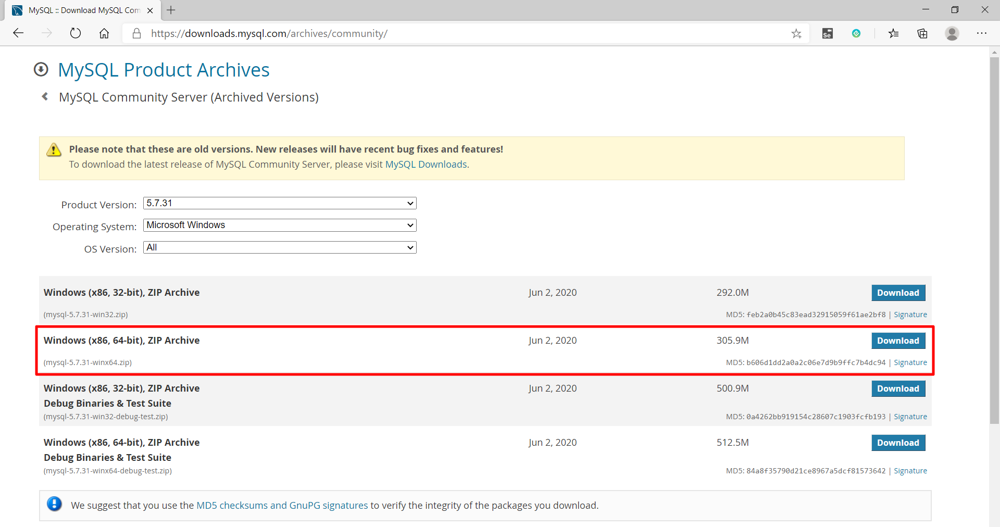
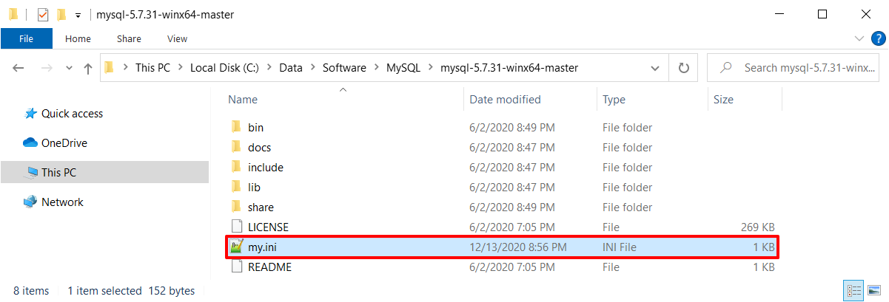
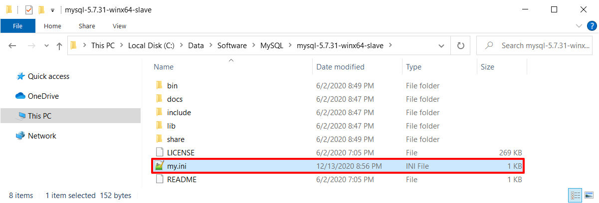
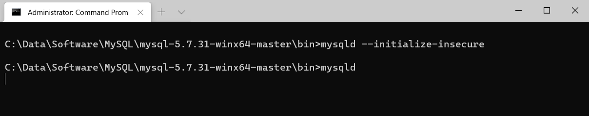
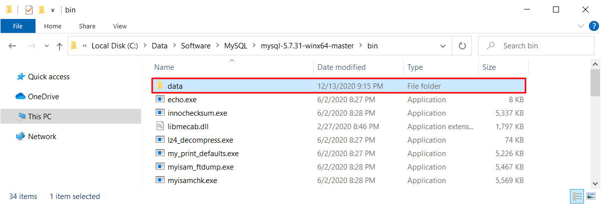
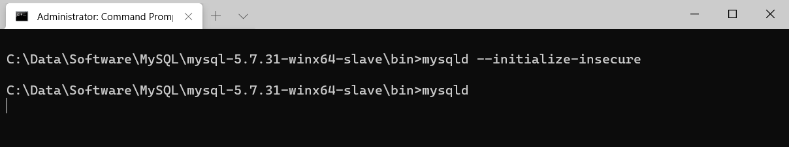
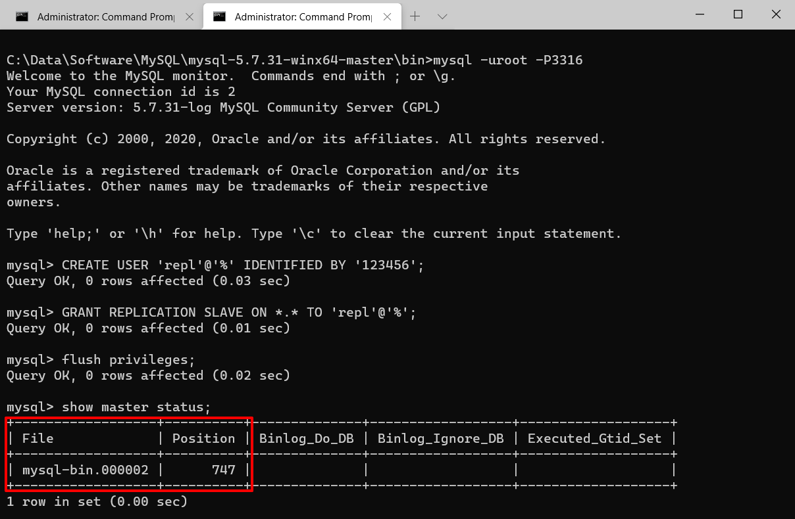
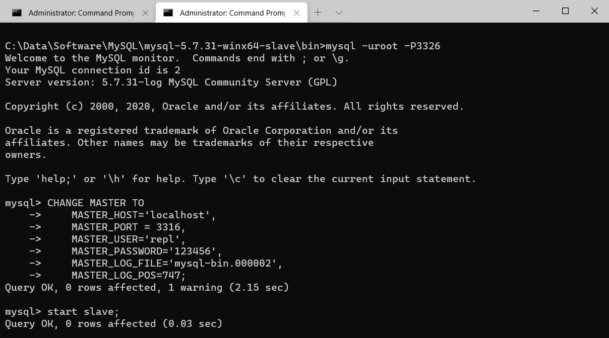
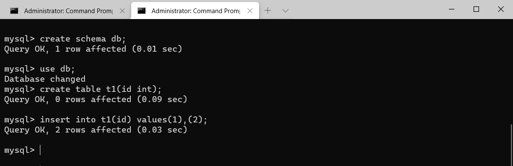
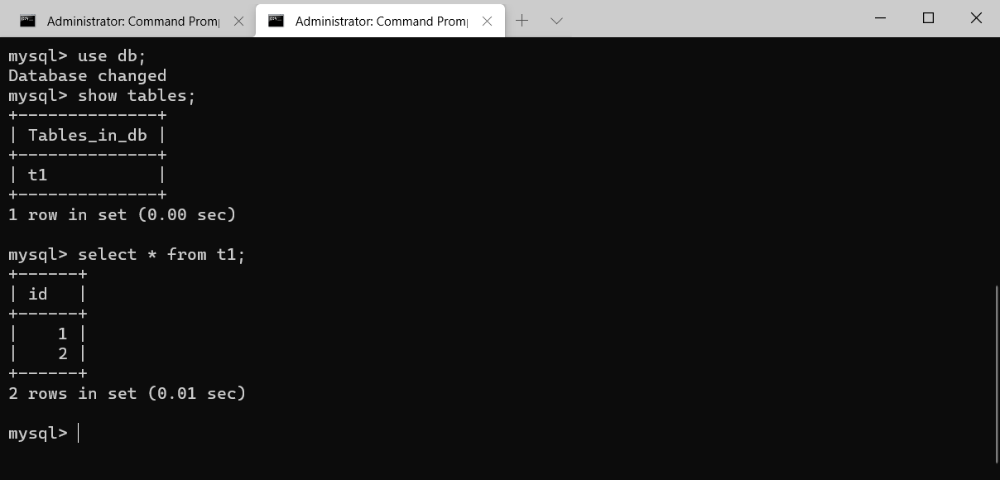

# 主从复制演示

[TOC]

## 下载mysql

下载地址：[MySQL :: Download MySQL Community Server (Archived Versions)](https://downloads.mysql.com/archives/community/)




## 准备两个MySQL服务实例

> Windows上可以用压缩版本，例如mysql-5.7.31-winx64.zip，解压文件夹再复制一份，添加my.ini配置文件。名字如下，分别作为主和从。
>
> - mysql-5.7.31-winx64-master
> - mysql-5.7.31-winx64-slave
>
> Mac和Linux环境，自己想办法，也可以用docker


## 创建主mysql-5.7.31-winx64-master的my.ini

```ini
[mysqld]
basedir = ./
datadir = ./data
port = 3316
server_id = 1

sql_mode=NO_ENGINE_SUBSTITUTION,STRICT_TRANS_TABLES 
log_bin=mysql-bin
binlog-format=Row
```





## 创建从mysql-5.7.31-winx64-slave的my.ini

```ini
[mysqld]
basedir = ./
datadir = ./data
port = 3326
server_id = 2

sql_mode=NO_ENGINE_SUBSTITUTION,STRICT_TRANS_TABLES 
log_bin=mysql-bin
binlog-format=Row
```




## 初始化和启动数据库

以 run as administrator 方式打开 Windows Terminal，空数据库需要执行 mysqld --initialize-insecure 进行初始化。

分别启动主和从，在命令行下直接执行mysqld或start mysqld命令即可。

主库截图如下：



会在**bin** folder中创建一个**data** 文件夹：




从库截图如下：




## 配置主节点

另打开一个command windows，执行mysql命令登录到主节点：mysql -uroot -P3316

然后执行如下命令，注意Position，后面从库要用到这个位置：




```mysql
mysql> CREATE USER 'repl'@'%' IDENTIFIED BY '123456';
Query OK, 0 rows affected (0.03 sec)

mysql> GRANT REPLICATION SLAVE ON *.* TO 'repl'@'%';
Query OK, 0 rows affected (0.01 sec)

mysql> flush privileges;
Query OK, 0 rows affected (0.02 sec)

mysql> show master status;
+------------------+----------+--------------+------------------+-------------------+
| File             | Position | Binlog_Do_DB | Binlog_Ignore_DB | Executed_Gtid_Set |
+------------------+----------+--------------+------------------+-------------------+
| mysql-bin.000002 |      747 |              |                  |                   |
+------------------+----------+--------------+------------------+-------------------+
1 row in set (0.00 sec)
```


## 配置从节点

另打开一个command windows，执行mysql命令登录到从节点：mysql -uroot -P3326



注意MASTER_LOG_FILE和MASTER_LOG_POS为主库中的信息一致：

```mysql
CHANGE MASTER TO
    MASTER_HOST='localhost',  
    MASTER_PORT = 3316,
    MASTER_USER='repl',      
    MASTER_PASSWORD='123456',   
    MASTER_LOG_FILE='mysql-bin.000002',
    MASTER_LOG_POS=747;
    
    //MASTER_AUTO_POSITION = 1;
```

然后启动从库，执行 start slave;    

```mysql
mysql> CHANGE MASTER TO
    ->     MASTER_HOST='localhost',
    ->     MASTER_PORT = 3316,
    ->     MASTER_USER='repl',
    ->     MASTER_PASSWORD='123456',
    ->     MASTER_LOG_FILE='mysql-bin.000002',
    ->     MASTER_LOG_POS=747;
Query OK, 0 rows affected, 1 warning (2.15 sec)

mysql> start slave;
Query OK, 0 rows affected (0.03 sec)
```


## 验证操作

### 在主库创建数据

在主库执行：

```mysql
mysql> create schema db;
Query OK, 1 row affected (0.01 sec)

mysql> use db;
Database changed
mysql> create table t1(id int);
Query OK, 0 rows affected (0.09 sec)

mysql> insert into t1(id) values(1),(2);
Query OK, 2 rows affected (0.03 sec)
```



### 从库自动同步数据

在从库查看数据同步情况，发现schema、table和record，都能自动同步：



```mysql
mysql> use db;
Database changed
mysql> show tables;
+--------------+
| Tables_in_db |
+--------------+
| t1           |
+--------------+
1 row in set (0.00 sec)

mysql> select * from t1;
+------+
| id   |
+------+
|    1 |
|    2 |
+------+
2 rows in set (0.01 sec)
```


## 查看命令

可以通过show master status\G, show slave status\G 查看状态。

可以通过stop slave; start slave;来启动、停止复制。


## 其他

GTID与复制：

https://blog.51cto.com/13540167/2086045

https://www.cnblogs.com/zping/p/10789151.html

半同步复制：

https://www.cnblogs.com/zero-gg/p/9057092.html

组复制：

https://www.cnblogs.com/lvxqxin/p/9407080.html