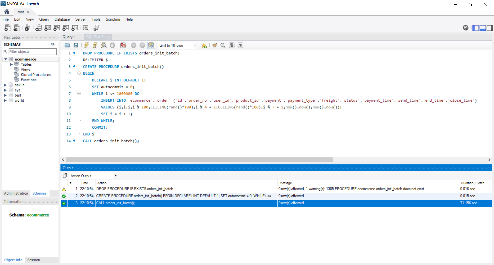
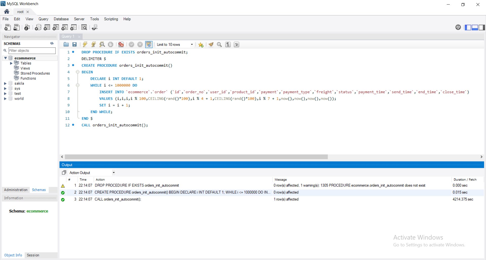

# 作业

只完成了作业1，本周的精力都用于准备ACP考试。作业2、3周日再补交。


## 作业1

按自己设计的表结构，插入100万订单模拟数据，测试不同方式的插入效率。

**答案：**

第一种方法：创建一个存储过程，关闭autocommit，批量创建数据：

```mssql
DROP PROCEDURE IF EXISTS orders_init_batch;
DELIMITER $
CREATE PROCEDURE orders_init_batch()
BEGIN
	DECLARE i INT DEFAULT 1;
	SET autocommit = 0;
	WHILE i <= 1000000 DO
		INSERT INTO `ecommerce`.`order` (`id`,`order_no`,`user_id`,`product_id`,`payment`,`payment_type`,`freight`,`status`,`payment_time`,`send_time`,`end_time`,`close_time`)
		VALUES (i,i,i,i % 100,CEILING(rand()*100),i % 4 + 1,CEILING(rand()*100),i % 7 + 1,now(),now(),now(),now());
		SET i = i + 1;
	END WHILE;
	COMMIT;
END $
CALL orders_init_batch();
```

运行时间：71.156 sec




第二种办法：创建一个存储过程，使用默认的自动提交，自动创建每一条数据：

```mysql
DROP PROCEDURE IF EXISTS orders_init_autocommit;
DELIMITER $
CREATE PROCEDURE orders_init_autocommit()
BEGIN
	DECLARE i INT DEFAULT 1;
	WHILE i <= 1000000 DO
		INSERT INTO `ecommerce`.`order` (`id`,`order_no`,`user_id`,`product_id`,`payment`,`payment_type`,`freight`,`status`,`payment_time`,`send_time`,`end_time`,`close_time`)
		VALUES (i,i,i,i % 100,CEILING(rand()*100),i % 4 + 1,CEILING(rand()*100),i % 7 + 1,now(),now(),now(),now());
		SET i = i + 1;
	END WHILE;
END $
CALL orders_init_autocommit();
```

运行时间：




## 作业2 

读写分离-动态切换数据源版本1.0


## 作业3 

读写分离-数据库框架版本2.0